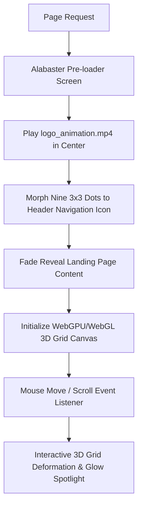
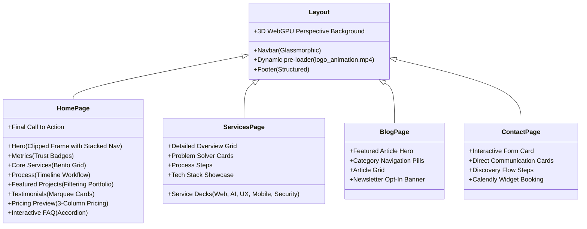

# Ekavex Global UI/UX Design Blueprint & Component Architecture

This document establishes the comprehensive UI/UX Design Blueprint for **Ekavex** (formerly Ekavex), a premium digital agency specializing in Web Development, AI Automation, SaaS platforms, Mobile Applications, and Cybersecurity solutions. 

---

## 1. Executive Visual Strategy & Brand Identity

The visual strategy of Ekavex is designed to convey **elite craftsmanship, technical sophistication, and high-agency execution**. It rejects the sterile, dark-themed SaaS templates in favor of a warm, luxurious editorial layout that balances mathematical precision with organic premium design, heavily drawing from the **"Taste Skill"** aesthetic standard.

### Core Assets Mapping
- **Agency Name:** **Ekavex** (referenced in `ref_img1.png`)
- **Brand Logo (`logo.jpeg`):** A sophisticated 3x3 layout of nine solid circular dots in warm orange/coral tones, representing connected neural nodes, modular systems, and clean mathematical arrangement.
- **Logo Animation (`logo_animation.mp4`):** A fluid motion sequence where the 3x3 circular nodes assemble, pulse, and lock into place, establishing an elegant visual narrative on boot-up.
- **Visual References:**
  - `ref_img1.png` / `ref_img4.png`: Custom clipped container layouts, vertical floating navbars inside heroes, three anchored cards with pill-borders, and interactive orange wireframe perspective lines.
  - `ref_img2.jpeg`: Complete multi-section content rhythm, clean filtering portfolio grids, unified icon typography, and clean tabbing structures.
  - `ref_img3.png`: Centered hero layouts with capsule badges ("AetherAI Next-Gen Engine Active") and organic 3D network lines.

---

## 2. Global Design Tokens & Foundation

### Color System (The Editorial Ivory Palette)
We isolate explicit UI constraints and colors from the visual assets and `instruction.md`:
* **Background Primary:** `#FFFDF6` (Alabaster Ivory / Warm Soft Cream). This off-white shade prevents screen glare, establishes high-end print-like editorial quality, and feels exceptionally premium.
* **Typography & Ink Primary:** `#09122C` (Deep Luxury Navy / Ink Black). Provides perfect contrast against `#FFFDF6` and is used for solid headers, deep subheadings, and dark button states.
* **Accent Primary:** `#EA6E38` (Warm Coral / Active Orange). Extracted directly from `logo.jpeg` and `ref_img1.png`. Used for visual focal points, primary active indicators, focus highlights, and branding indicators.
* **Secondary Alabaster:** `#FAF6ED` (Soft Alabaster Border / Secondary Card Base). Used for card backgrounds to pop subtly from `#FFFDF6`.
* **Glow/Highlight:** `rgba(234, 110, 56, 0.15)` (Active Coral Glow). Used for soft shadows and card hover glows.
* **Glassmorphism Base:** `rgba(255, 253, 246, 0.65)` backdropped with `blur(12px)` and bordered with `rgba(9, 18, 44, 0.05)`.

### Typography Principles
* **Hero Headline (H1):** *Outfit* or *Clash Display* (Sans-serif with high geometric elegance). Bold, thick weight (700/800), tight letter-spacing (`-0.03em`), and strict line-height (`1.05`).
* **Subheadings & Body Text:** *Inter* or *Spline Sans*. Highly legible, crisp rendering at smaller sizes. Regular/Medium weight (400/500), optimized line-height (`1.5` to `1.6`) for reading comfort.
* **Badges & Label Caps:** *JetBrains Mono* or *Space Grotesk*. Clean monospaced aesthetics for tags, metrics, and indicators (e.g., "Web Development", "AI Automation").

### Layout & Border Rules
* **Card Corner Rounding:** `24px` (`rounded-3xl` in Tailwind) to maintain soft, premium organic flows.
* **Hero Clipping Mask:** A custom asymmetrical bezier-curve clipped container (`clip-path: path(...)`) that creates a wave-pill layout on the bottom-right and center, precisely matching the elegant structure in `ref_img1.png` and `ref_img4.png`.
* **Spacing Rhythm:** Spacious layouts with generous padding (`py-24`, `gap-16`) to let content "breathe," aligning with the premium editorial look.

---

## 3. Interactive loading & 3D WebGPU Engine Pipeline

To capture the "wow-factor" of the **Taste Skill** and **WebGPU Claude Skill** references, the frontend hooks the brand logo animation and real-time interactive graphics into a unified pipeline.

### The Pre-Loader Sequence (Logo Hook-in)
1. **The Canvas:** Full-page solid `#FFFDF6` screen.
2. **Animation Loop:** Play the `logo_animation.mp4` video masked cleanly as a circle, or render a Three.js canvas mimicking the dot configuration.
3. **The Morph (LayoutId Transition):** As the animation ends, the 9 orange circles of the logo shrink, rearrange, and animate dynamically using a Framer Motion `layoutId` into the logo slot in the header navbar at the top-left of the page.
4. **The Page Reveal:** The background splits horizontally or scales down in a circle to reveal the fully loaded home screen.

### 3D Perspective Network Background (WebGPU-Inspired)
* **The Concept:** A live, dynamic perspective grid representing data channels and AI connectivity, matching `ref_img1.png` and `ref_img3.png`.
* **Implementation Details:**
  - Render a WebGL/Three.js custom grid mesh colored in semi-transparent coral/navy (`#EA6E38` at `opacity: 0.08`, `#09122C` at `opacity: 0.03`).
  - **Magnetic Mouse Interactivity:** As the user moves their cursor over the screen, the grid lines deform gently towards the cursor coordinates (Spotlight / Gravity effect).
  - **Scroll-Linked Rotation:** Scrolling down rotates the 3D grid perspective camera downwards, giving the user a deep sense of flying through a network city.

---

## 4. Component Architecture Roadmap

This roadmap categorizes every key UI component based on target patterns, source links (shadcn via `21st.dev` & `Lightswind`), visual style, and premium micro-interactions.

| Component Type | Target Source / Pattern (21st.dev / shadcn) | Visual Style (Matching References) | Expected Micro-Interactions |
| :--- | :--- | :--- | :--- |
| **Glassmorphic Top Navbar** | [Animated Navbar by @ui-ux](https://21st.dev/r/navbar) | Floating translucent pill (`rgba(255,255,255,0.7)`) with very fine border (`#09122C` at 5% opacity). Logo at left, items center, "Start a Project" button at right. | Magnetic hover on links, slide-down on scroll-up, hide on scroll-down, smooth morph on active tab indicator. |
| **Clipped Hero Frame** | Custom Bezier Clip Grid (from `ref_img1.png`) | Asymmetric rounded clip mask. Contains a background WebGL interactive wireframe, massive Headline H1 (`#09122C`), a Coral Pill CTA button, and a vertical stacked navigation bar on the right. | Elastic hover on CTA button. Smooth fade-in reveal with a staggered character-reveal on the H1 headline. Navigation items show sliding orange arrows. |
| **Anchored Info Cards** | [3D Hover Cards by @aceternity](https://21st.dev/r/3d-card) | Three card layout at the bottom of the hero. `#FAF6ED` background, high rounded corner (`24px`), custom circular orange icon, bold navy title, clean body description. | 3D Tilt perspective effect following the cursor coordinates. On hover, the circular orange icon animates (rotates/pulses) and the card border glows. |
| **Metrics Stats Tracker** | [Scroll Countup by @framer-motion](https://21st.dev/r/scroll-count) | 3-column stats section with a thin warm-border top/bottom. Accentuated numbers in `#EA6E38`. | Scroll-triggered count-up animation (`0` to `25+`, `70%`, etc.), numbers easing smoothly using a spring hook. |
| **Core Services Bento Grid** | [Bento Grid by @aceternity](https://21st.dev/r/bento-grid) | 4-grid and 3-grid blocks (`ref_img2.jpeg`). Soft off-white backgrounds, thin borders. Each grid contains a description, an icon, and a "Learn More ->" link. | Spotlights follow the cursor inside the card borders. Upon entering, the subtle grid borders light up with a glowing coral pulse. |
| **Industry Badges Grid** | [Magnetic Badges by @lightswind](https://lightswind.com) | Small, rounded warm-tan pill buttons with simple inline SVG icons. Layout is a centered horizontal grid. | Gentle hover magnification. Cards drag-interactable or float slightly. |
| **Portfolio Filtering Grid** | [Animated Tabs & Grid by @framer-motion](https://21st.dev/r/tabs) | Segmented tab controls at the top ("All", "Web", "AI", "SaaS"). Below is a 2x2 card grid with screenshots, titles, tags, and outcomes. | Smooth layout morph (sliding pill background behind the active filter tab). Card images zoom slightly on hover with a slide-up caption overlay. |
| **How We Work (Timeline)** | [SVG Drawing Path Timeline by @ui-ux](https://21st.dev/r/timeline) | Horizontal linear path with four circular nodes (01 to 04). Background grid pattern. | SVG line path draws itself dynamically on scroll. Dots expand and pulse in Coral orange when they enter the viewport center. |
| **Testimonial Slider** | [Infinite Marquee by @aceternity](https://21st.dev/r/marquee) | 3-column masonry list or horizontal moving row of elegant ivory reviews with stars. | Infinite marquee pause-on-hover. Smooth drag-scrolling for mobile devices. |
| **Team / Led by Experience** | Split Screen Column Layout | Left column: high-end portrait (with canvas mesh/noise overlay). Right column: detailed bulleted copy with a soft grid background. | Portrait has a subtle floating micro-animation. Text block items fade-reveal with a staggered scroll reveal. |
| **Interactive Glass Contact Form**| [Input Glow Form by @shadcn](https://21st.dev/r/form) | Blurry translucent card with large text fields, soft drop shadow, custom select drop-downs for budget and timeline, solid Navy action button. | Inputs have a warm coral underline grow-effect on focus. Button has a magnetic pull effect towards the cursor. |
| **Footer Component** | Clean Minimal Grid | 4-column structured footer layout. Left column has tagline & dynamic logo animation. Bottom has copyright and legal links. | Hover transitions from deep navy `#09122C` to active coral `#EA6E38` on all links. |

---

## 5. Page-by-Page Architectural Mapping

This section maps all site content files (`.md` sources) directly into their respective frontend component slots, ensuring that **zero content is lost** and layout rhythm is maintained.

### A. Home Page (Mapping `HomePage.md`)
1. **Hero Area:**
   - **Headline (H1):** Option 3: *"Modern Web, AI & Automation Solutions Built For Business Growth"*.
   - **Subheadline:** Version 2: *"From AI-powered automation systems to scalable SaaS platforms and modern websites..."*.
   - **CTAs:** Primary *"Start Your Project"* (Coral button) & Secondary *"Explore Services"* (Warm Ivory button).
   - **Vertical Stack Navbar Items:** "Home", "Services", "About", "Team", "Case Studies", "Contact".
2. **Trust & Social Proof Metrics:**
   - Highlights: *"25+ Projects Successfully Delivered"*, *"100% Transparent Workflow"*, *"Weekly Client Updates"*, *"1-Month Post Launch Support"*.
   - Mini Testimonial Quote: *“The team maintained excellent communication throughout the project...”*.
3. **Core Services Bento Grid:**
   - Mapping the 6 primary services (Web, AI Automation, UI/UX, Mobile App, AI Services, Cybersecurity, Integrated Solutions) with custom inline icons (Browser, AI Circuit, Pen Tool, Smartphone, Brain, Lock, Connected Nodes).
4. **Why Choose Us Section:**
   - Layout: 3x2 grid of detailed feature cards (Fast Delivery, AI-Powered Workflow, Transparent Updates, Long-Term Support, Scalable Solutions, Client-Centric).
5. **Development Workflow Section:**
   - Layout: Interactive SVG Timeline drawing path showing steps: *1. Discovery*, *2. Strategy*, *3. UI/UX Design*, *4. Development*, *5. Feedback Loop*, *6. Launch*, *7. Support*.
6. **Featured Projects Showcase:**
   - Displays 5 completed case studies (*AI SQL Chatbot*, *SaaS Platform*, *Fintech Mutual Fund*, *AI Warehouse Monitoring*, *CRM & SaaS*). Includes filter controls.
7. **Testimonials Grid:**
   - Cards showing reviews from *Rahul Sharma (Founder - Tech Startup)*, *Priya Mehta (Fintech)*, and *Amit Verma (Retail)*.
8. **Pricing Preview Cards:**
   - 3 elegant packages: *Starter (₹25,000+)*, *Growth (₹75,000+)*, *Enterprise (Custom)*.
9. **FAQ Section:**
   - Styled Accordion (shadcn component) answering 10 primary project questions.
10. **Final Call to Action Banner:**
    - Option 2: *"Let’s Build Something Extraordinary Together"*. Buttons: *"Start Your Project"* & *"WhatsApp Chat"*.

### B. Services Page (Mapping `Aboutus.md`)
*Note: The content inside `Aboutus.md` is explicitly titled "SERVICES PAGE CONTENT" and maps to the Services Page.*
1. **Services Hero:**
   - **H1 Option 3:** *"Modern Web, AI & Automation Services Designed To Scale Businesses"*.
   - Subheadline, Call to Action buttons, and trust badges.
2. **Services Overview Grid:**
   - 7 primary services with Key Outcomes mapped directly to interactive grid items.
3. **Detailed Service Decks:**
   - Alternating left/right detailed vertical layout panels for the 6 departments (Web Dev, AI Automation, UI/UX, Mobile, Cybersecurity, Integrated Solutions). Mapped variables:
     - **Problems We Solve** (e.g., *Confusing interfaces*, *Slow performance*).
     - **Benefits & Deliverables** (e.g., *Interactive prototypes*, *Vulnerability testing*).
     - **Technologies Used** (represented as micro-badges).
4. **Why Our Services Stand Out:**
   - Mapped metrics and points: *Fast Delivery*, *AI-Enhanced Workflow*, *Transparent Communication*, *Agile Process*, *One Month Free Support*, *24/7 Assistance*.
5. **Technology Stack Showcase:**
   - Beautiful visual layout grouping tech logos into Frontend, Backend, AI/Automation, Mobile, Cloud, Security.

### C. Case Studies & Portfolio (Mapping `casestudy.md` & `portfolio.md`)
1. **Case Studies Hero:**
   - H1 Option 2: *"Transforming Ideas Into Scalable AI-Powered Solutions"*.
2. **Interactive Filters:**
   - Tags: *Web Development*, *AI Automation*, *SaaS Platforms*, *UI/UX Design*, *Mobile Apps*, *Cybersecurity*, *Fintech*.
3. **Case Study Detailed Pages:**
   - Detailed visual breakdown templates for the 4 core featured projects:
     - **AI SQL Assistant Platform** (8 Weeks, AI Development)
     - **Agentic AI SaaS Platform** (12 Weeks, SaaS & AI Automation)
     - **Fintech Mutual Fund Management System** (10 Weeks, Finance & Investment)
     - **AI Warehouse Monitoring Solution** (Logistics & Warehousing)
   - Layout template segments:
     - *Client & Scope Banner* (Confidential Startup, timeline, technologies).
     - *Business Challenge Paragraph* (The problem: technical barriers, manual workflows).
     - *Strategy Map* ( conversational UI, NLP query processing).
     - *Design & Development Stage* (Figma wireframes, React/Node code, OpenAI APIs).
     - *Key Results Metric Column* (e.g., *70% query time reduction*).
     - *Client Testimonial block*.

### D. Blog Section (Mapping `blogsection.md`)
1. **Blog Hero:**
   - Option 4: *"AI, Development & Growth Insights From Industry Experts"*.
2. **Featured Post Spotlight:**
   - Large banner showcasing: *"How AI Automation Is Transforming Modern Business Workflows"* (8 Min Read, April 2026, by Vishal Jangid).
3. **Category Navigation Pills:**
   - Monospaced tag filters for all articles.
4. **Blog Article Grid:**
   - Mapped components for Articles 01 through 08. Custom author portraits, reading time calculators, categories, and modern clean cards with hover image zooms.
5. **Newsletter Opt-in Form:**
   - Glassmorphic card overlay centered with an input field: *"Enter your email"* and a *"Join Newsletter"* CTA.

### E. Contact Page (Mapping `contactus.md`)
1. **Contact Hero:**
   - Option 1: *"Let’s Build Something Extraordinary Together"*.
2. **Split Form Layout:**
   - **Left Panel:** Premium dynamic contact form utilizing the mapped dropdown fields (Services Required, Budget Options, Timeline Options).
   - **Right Panel:** Direct Communication cards showing Business Email (`hello@youragency.com`), Phone (`+91 XXXXX XXXXX`), and WhatsApp Chat link. Including Availability Status badge (*"Currently Accepting New Projects for May 2026"*).
3. **Post-Contact Discovery Flow:**
   - 6-step progress stepper showcasing what happens next (*Discovery*, *Strategy*, *Proposal*, *Development*, *Feedback*, *Launch*).
4. **Embedded Calendly/Google Meet Scheduling Section:**
   - Premium clean container with an embedded booking calendar widget.

---

## 6. Premium UX Guidelines & Quality Checklist

To maintain the elite **Taste Skill** quality across development phases:
- **Rule of Visual Contrast:** Strict typography readability. No grey-on-grey text. Use `#09122C` for primary headers, `#09122C` with `80% opacity` for body text, and solid `#FFFDF6` background.
- **Rule of Transition Physics:** Every transition must use spring physics (`type: "spring", stiffness: 100, damping: 15`). Absolutely no harsh instant state swaps.
- **Responsive Layout Integrity:** Form inputs must expand cleanly on touch. Navigation turns into a premium glassmorphic bottom-sheet on mobile devices, preventing finger stretching.
- **Performance Budget:** Canvas elements must automatically throttle framerate on low-performance batteries, maintaining a lightweight footprints.
- **Agile Hook:** Keep all content modules highly decoupled, allowing direct programmatic editing without mutating the global design system tokens.
