# solven Design System

You are building UI for **solven**. Dark-themed, warm palette, sans-serif typography (DM Serif Display), compact density on a 4px grid.

## Visual Reference

**IMPORTANT**: Study ALL screenshots below before writing any UI. Match colors, typography, spacing, layout, and motion exactly as shown.

### Homepage

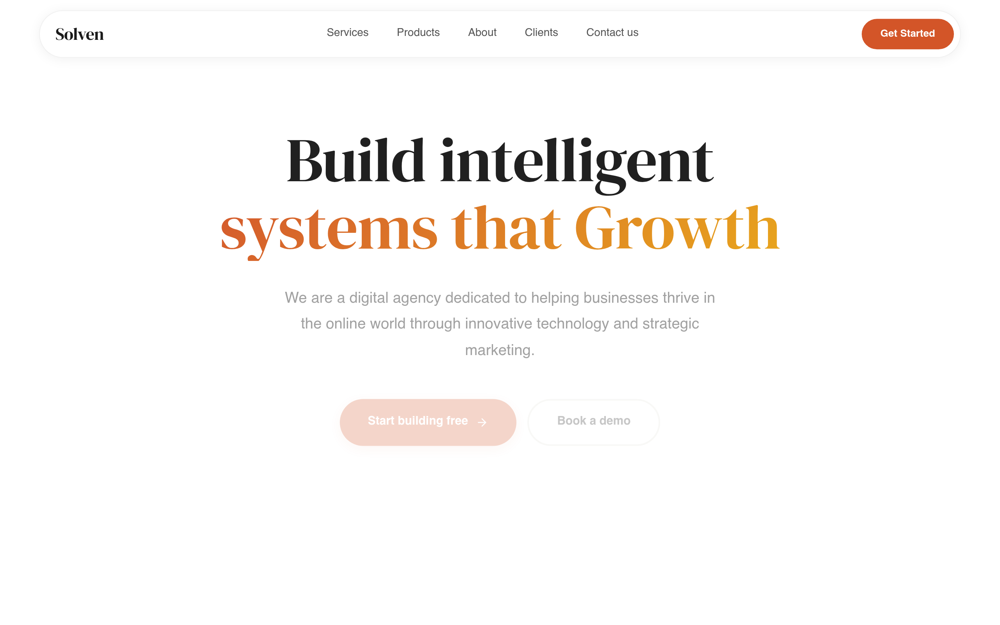

### Scroll Journey (Cinematic Visual States)

> These screenshots capture the website at different scroll depths. The design changes dramatically as you scroll - each frame shows a different cinematic state. Replicate these exact visual transitions.

#### 0% - Hero / Above the fold


#### 17% - Mid-page at 17% scroll

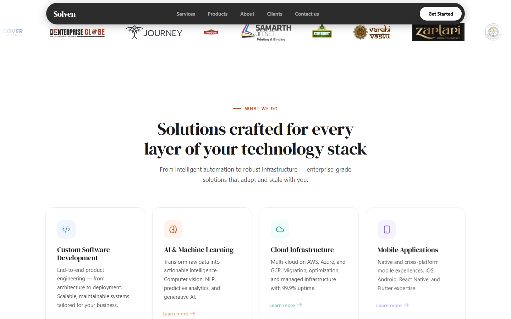

#### 33% - Mid-page at 33% scroll

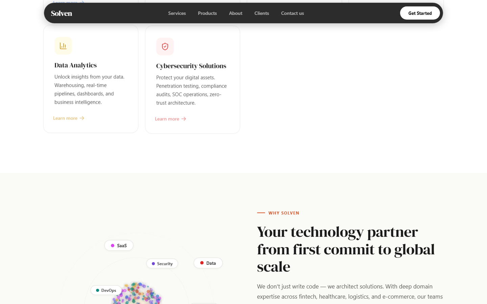

#### 50% - Mid-page at 50% scroll

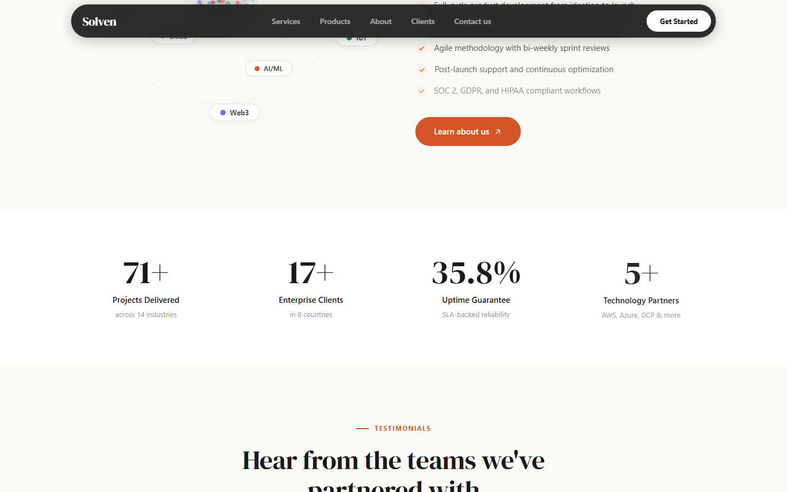

#### 67% - Mid-page at 67% scroll

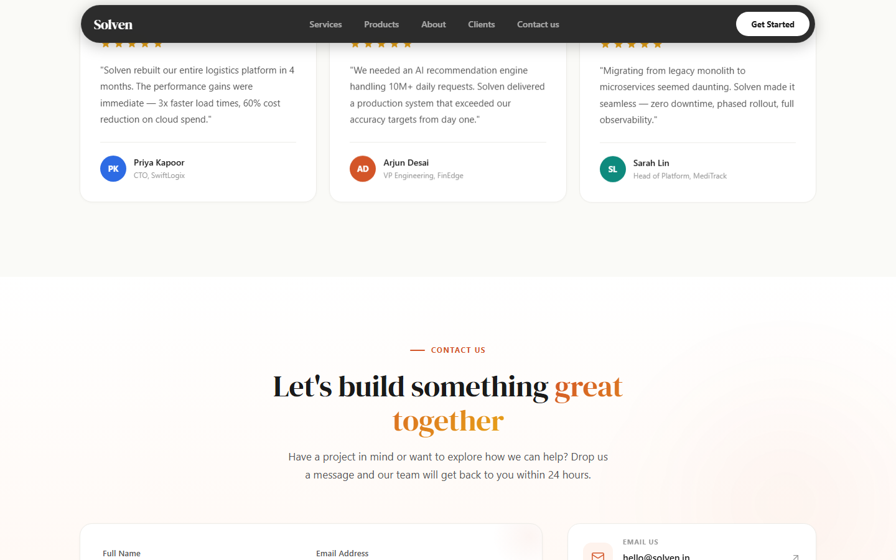

#### 83% - Mid-page at 83% scroll

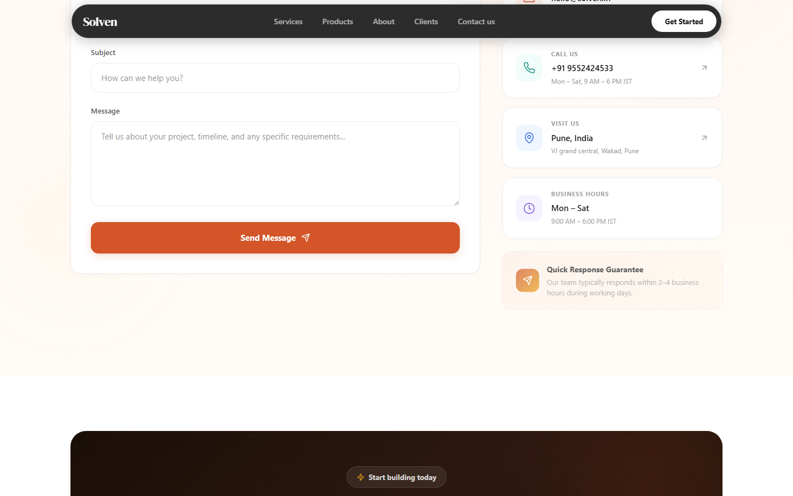

#### 100% - Footer / End of page

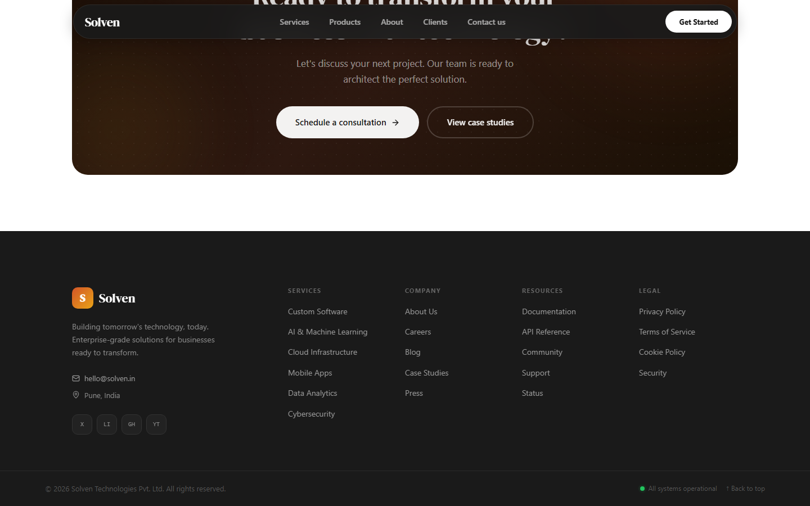

### Video Backgrounds (First Frames)

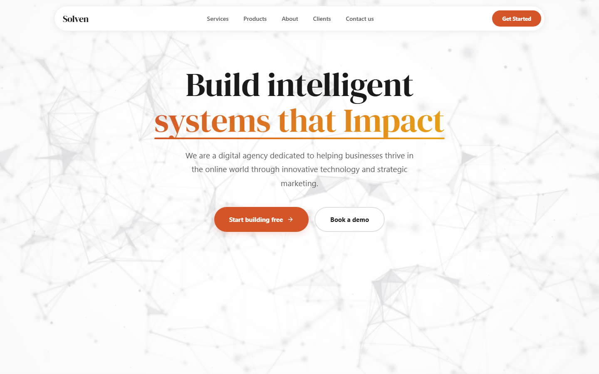

> Read `references/DESIGN.md` for full token details. Read `references/ANIMATIONS.md` for motion specs. Read `references/LAYOUT.md` for layout structure. Read `references/COMPONENTS.md` for component patterns.

## Ultra Reference Files

This package includes extended documentation. **Read these files before implementing:**

| File | Contents |
|------|----------|
| `references/DESIGN.md` | Full design system tokens, colors, typography, spacing |
| `references/VISUAL_GUIDE.md` | **START HERE** - Master visual guide with all screenshots embedded |
| `references/ANIMATIONS.md` | CSS keyframes, scroll triggers, motion library stack, video specs |
| `references/LAYOUT.md` | Flex/grid containers, page structure, spacing relationships |
| `references/COMPONENTS.md` | DOM component patterns, HTML structure, class fingerprints |
| `references/INTERACTIONS.md` | Hover/focus states with before/after style diffs |
| `screens/scroll/` | 7 scroll journey screenshots showing cinematic states |

### Animation Stack Detected

- **Web Animations API (4 active)** - animation

## Design Philosophy

- **Layered depth** - use shadow tokens to create a sense of physical layering. Each elevation level has a specific shadow.
- **Gradient accents** - gradients are used thoughtfully for emphasis, not decoration.
- **Type pairing** - DM Serif Display for body/UI text, General Sans for headings/display. Never introduce a third typeface.
- **compact density** - 4px base grid. Every dimension is a multiple of 4.
- **warm palette** - the color temperature runs warm, matching the sans-serif typography.
- **Restrained accent** - `#d35528` is the only pop of color. Used exclusively for CTAs, links, focus rings, and active states.
- **Subtle motion** - transitions smooth state changes. Keep durations under 300ms, use ease-out curves.

## Color System

### Core Palette

| Role | Token | Hex | Use |
|------|-------|-----|-----|
| Background | `--background` | `#1a1a1a` | Page/app background |
| Surface | `--surface` | `#333333` | Cards, panels, modals |
| Text Primary | `--text-primary` | `#ffffff` | Headings, body text |
| Text Muted | `--text-muted` | `#999999` | Captions, placeholders |
| Accent | `--accent` | `#d35528` | CTAs, links, focus rings |
| Border | `--border` | `#555555` | Dividers, card borders |

### Status Colors

| Status | Hex | Use |
|--------|-----|-----|
| Success | `#22c55e` | Confirmations, positive trends |
| Warning | `#ca8a04` | Caution states, pending items |
| Danger | `#dc2626` | Errors, destructive actions |

### Extended Palette

- **border:** `#e2e0da`
- **border-light:** `#edece8` - Light surface or highlight color
- `#888888`
- `#2d6be4`
- `#0e8a7d`
- `#7048d6`
- `#666666`
- `#eff6ff` - Light surface or highlight color

### CSS Variable Tokens

```css
--border: #e2e0da;
--border-light: #edece8;
--ink-secondary: #555;
--ink-muted: #999;
--accent: #d35528;
--accent-dark: #b5441f;
--accent-bg: #fef3ed;
```

## Typography

### Font Stack

- **DM Serif Display** - Heading 1, Heading 2, Heading 3
- **General Sans** - Body, Caption
- **SFMono-Regular** - Code

### Font Sources

```css
@font-face {
  font-family: "DM Serif Display";
  src: url("fonts/DMSerifDisplay-Regular.ttf") format("truetype");
  font-weight: 400;
}
```

### Type Scale

| Role | Family | Size | Weight |
|------|--------|------|--------|
| Heading 1 | DM Serif Display | clamp(2.5rem,5vw,3.8rem) | 700 |
| Heading 2 | DM Serif Display | 15px | 700 |
| Heading 3 | DM Serif Display | 14px | 700 |
| Body | General Sans | 13px | 400 |
| Caption | General Sans | 12px | 400 |
| Code | SFMono-Regular | 14px | 400 |

### Typography Rules

- Body/UI: **DM Serif Display**, Headings: **General Sans** - these are the only display fonts
- Max 3-4 font sizes per screen
- Headings: weight 600-700, body: weight 400
- Use color and opacity for text hierarchy, not additional font sizes
- Line height: 1.5 for body, 1.2 for headings

## Spacing & Layout

### Base Grid: 4px

Every dimension (margin, padding, gap, width, height) must be a multiple of **4px**.

### Spacing Scale

`2, 4, 6, 8, 10, 12, 14, 16, 18, 20, 24, 32` px

### Spacing as Meaning

| Spacing | Use |
|---------|-----|
| 4-8px | Tight: related items (icon + label, avatar + name) |
| 12-16px | Medium: between groups within a section |
| 24-32px | Wide: between distinct sections |
| 48px+ | Vast: major page section breaks |

### Border Radius

Scale: `2px, 3px, 4px, 10px, 11px, 12px, 14px, 16px, 20px, 28px, 100px`
Default: `12px`

### Container

Max-width: `1023px`, centered with auto margins.

### Breakpoints

| Name | Value |
|------|-------|
| sm | 40rem |
| md | 48rem |
| lg | 64rem |
| xl | 80rem |
| 2xl | 96rem |
| sm | 640px |
| md | 767px |
| md | 768px |
| lg | 1023px |

Mobile-first: design for small screens, layer on responsive overrides.

## Component Patterns

### Card

```css
.card {
  background: #333333;
  border: 1px solid #555555;
  border-radius: 12px;
  padding: 16px;
  box-shadow: 0 1px 4px #00000008;
}
```

```html
<div class="card">
  <h3>Card Title</h3>
  <p>Card content goes here.</p>
</div>
```

### Button

```css
/* Primary */
.btn-primary {
  background: #d35528;
  color: #ffffff;
  border-radius: 12px;
  padding: 8px 16px;
  font-weight: 500;
  transition: opacity 150ms ease;
}
.btn-primary:hover { opacity: 0.9; }

/* Ghost */
.btn-ghost {
  background: transparent;
  border: 1px solid #555555;
  color: #ffffff;
  border-radius: 12px;
  padding: 8px 16px;
}
```

```html
<button class="btn-primary">Get Started</button>
<button class="btn-ghost">Learn More</button>
```

### Input

```css
.input {
  background: #1a1a1a;
  border: 1px solid #555555;
  border-radius: 12px;
  padding: 8px 12px;
  color: #ffffff;
  font-size: 14px;
}
.input:focus { border-color: #d35528; outline: none; }
```

```html
<input class="input" type="text" placeholder="Search..." />
```

### Badge / Chip

```css
.badge {
  display: inline-flex;
  align-items: center;
  padding: 4px 8px;
  border-radius: 9999px;
  font-size: 12px;
  font-weight: 500;
  background: #333333;
  color: #999999;
}
```

```html
<span class="badge">New</span>
<span class="badge">Beta</span>
```

### Modal / Dialog

```css
.modal-backdrop { background: rgba(0, 0, 0, 0.6); }
.modal {
  background: #333333;
  border: 1px solid #555555;
  border-radius: 100px;
  padding: 24px;
  max-width: 480px;
  width: 90vw;
  box-shadow: rgba(211, 85, 40, 0.2) 0px 4px 16px 0px;
}
```

```html
<div class="modal-backdrop">
  <div class="modal">
    <h2>Dialog Title</h2>
    <p>Dialog content.</p>
    <button class="btn-primary">Confirm</button>
    <button class="btn-ghost">Cancel</button>
  </div>
</div>
```

### Table

```css
.table { width: 100%; border-collapse: collapse; }
.table th {
  text-align: left;
  padding: 8px 12px;
  font-weight: 500;
  font-size: 12px;
  color: #999999;
  text-transform: uppercase;
  letter-spacing: 0.05em;
  border-bottom: 1px solid #555555;
}
.table td {
  padding: 12px;
  border-bottom: 1px solid #555555;
}
```

```html
<table class="table">
  <thead><tr><th>Name</th><th>Status</th><th>Date</th></tr></thead>
  <tbody>
    <tr><td>Item One</td><td>Active</td><td>Jan 1</td></tr>
    <tr><td>Item Two</td><td>Pending</td><td>Jan 2</td></tr>
  </tbody>
</table>
```

### Navigation

```css
.nav {
  display: flex;
  align-items: center;
  gap: 8px;
  padding: 12px 16px;
  border-bottom: 1px solid #555555;
}
.nav-link {
  color: #999999;
  padding: 8px 12px;
  border-radius: 12px;
  transition: color 150ms;
}
.nav-link:hover { color: #ffffff; }
.nav-link.active { color: #d35528; }
```

```html
<nav class="nav">
  <a href="/" class="nav-link active">Home</a>
  <a href="/about" class="nav-link">About</a>
  <a href="/pricing" class="nav-link">Pricing</a>
  <button class="btn-primary" style="margin-left: auto">Get Started</button>
</nav>
```

## Animation & Motion

This project uses **subtle motion**. Transitions smooth state changes without calling attention.

### CSS Animations

- `slide`
- `ping`

### Motion Tokens

- **Duration scale:** `.3s`, `200ms`, `300ms`, `450ms`
- **Easing functions:** `ease`

### Motion Guidelines

- **Duration:** Use values from the duration scale above. Short (.3s) for micro-interactions, long (450ms) for page transitions
- **Easing:** Use `ease` as the default easing curve
- **Direction:** Elements enter from bottom/right, exit to top/left
- **Reduced motion:** Always respect `prefers-reduced-motion` - disable animations when set

## Depth & Elevation

### Shadow Tokens

- Raised (cards, buttons): `0 1px 4px #00000008`
- Raised (cards, buttons): `rgba(0, 0, 0, 0.02) 0px 1px 3px 0px`
- Raised (cards, buttons): `rgba(0, 0, 0, 0.04) 0px 1px 4px 0px`
- Raised (cards, buttons): `rgba(0, 0, 0, 0.03) 0px 1px 4px 0px`
- Raised (cards, buttons): `rgba(0, 0, 0, 0.04) 0px 2px 8px 0px`
- Floating (dropdowns, popovers): `rgba(211, 85, 40, 0.2) 0px 4px 16px 0px`

### Z-Index Scale

`10`

Use these exact values - never invent z-index values.

## Anti-Patterns (Never Do)

- **No blur effects** - no backdrop-blur, no filter: blur()
- **No zebra striping** - tables and lists use borders for separation
- **No invented colors** - every hex value must come from the palette above
- **No arbitrary spacing** - every dimension is a multiple of 4px
- **No extra fonts** - only DM Serif Display and General Sans and SFMono-Regular are allowed
- **No arbitrary border-radius** - use the scale: 2px, 3px, 4px, 10px, 11px, 12px, 14px, 16px, 20px, 28px
- **No opacity for disabled states** - use muted colors instead

## Workflow

1. **Read** `references/DESIGN.md` before writing any UI code
2. **Pick colors** from the Color System section - never invent new ones
3. **Set typography** - DM Serif Display, General Sans, SFMono-Regular only, using the type scale
4. **Build layout** on the 4px grid - check every margin, padding, gap
5. **Match components** to patterns above before creating new ones
6. **Apply elevation** - use shadow tokens
7. **Validate** - every value traces back to a design token. No magic numbers.

## Brand Spec

- **Favicon:** `/favicon.ico`
- **Site URL:** `https://solven.in/`
- **Brand color:** `#d35528`
- **Brand typeface:** DM Serif Display

## Quick Reference

```
Background:     #1a1a1a
Surface:        #333333
Text:           #ffffff / #999999
Accent:         #d35528
Border:         #555555
Font:           DM Serif Display
Spacing:        4px grid
Radius:         12px
Components:     0 detected
```

## When to Trigger

Activate this skill when:
- Creating new components, pages, or visual elements for solven
- Writing CSS, Tailwind classes, styled-components, or inline styles
- Building page layouts, templates, or responsive designs
- Reviewing UI code for design consistency
- The user mentions "solven" design, style, UI, or theme
- Generating mockups, wireframes, or visual prototypes

---

# Full Reference Files

> Every output file is embedded below. Claude has full design system context from /skills alone.

## Design System Tokens (DESIGN.md)

# solven DESIGN.md

> Auto-generated design system - reverse-engineered via static analysis by skillui.
> Frameworks: None detected
> Colors: 20 · Fonts: 3 · Components: 0
> Icon library: not detected · State: not detected
> Primary theme: dark · Dark mode toggle: no · Motion: subtle

## Visual Reference

**Match this design exactly** - study colors, fonts, spacing, and component shapes before writing any UI code.


---

## 1. Visual Theme & Atmosphere

This is a **dark-themed** interface with a warm tone. Depth is expressed through layered shadows and subtle surface color variation. Typography pairs **General Sans** for display/headings with **DM Serif Display** for body text, creating clear visual hierarchy through type contrast. Spacing follows a **4px base grid** (compact density), with scale: 2, 4, 6, 8, 10, 12, 14, 16px. The accent color **#d35528** anchors interactive elements (buttons, links, focus rings). Motion is subtle - smooth transitions (150-300ms) ease state changes without drawing attention.

---

## 2. Color Palette & Roles

| Token | Hex | Role | Use |
|---|---|---|---|
| background | `#1a1a1a` | background | Page background, darkest surface |
| surface | `#333333` | surface | Card and panel backgrounds |
| tw-ring-offset-color | `#ffffff` | text-primary | Headings and body text |
| ink-muted | `#999999` | text-muted | Captions, placeholders, secondary info |
| ink-secondary | `#555555` | border | Dividers, card borders, outlines |
| accent | `#d35528` | accent | CTAs, links, focus rings, active states |
| accent-bg | `#fef3ed` | accent | CTAs, links, focus rings, active states |
| danger | `#dc2626` | danger | Error states, destructive actions |
| success | `#22c55e` | success | Success states, positive indicators |
| warning | `#ca8a04` | warning | Warning states, caution indicators |
| info | `#2d6be4` | info | Informational highlights |
| border | `#e2e0da` | unknown | Palette color |
| border-light | `#edece8` | unknown | Palette color |
| unknown | `#888888` | unknown | Palette color |
| unknown | `#0e8a7d` | unknown | Palette color |
| unknown | `#7048d6` | unknown | Palette color |
| unknown | `#666666` | unknown | Palette color |
| unknown | `#eff6ff` | unknown | Palette color |
| unknown | `#e8a317` | unknown | Palette color |
| unknown | `#0a0930` | unknown | Palette color |

### CSS Variable Tokens

```css
--tw-border-style: solid;
--border: #e2e0da;
--border-light: #edece8;
--ink-secondary: #555;
--ink-muted: #999;
--accent: #d35528;
--accent-dark: #b5441f;
--accent-bg: #fef3ed;
```


---

## 3. Typography Rules

**Font Stack:**
- **DM Serif Display** - Heading 1, Heading 2, Heading 3
- **General Sans** - Body, Caption
- **SFMono-Regular** - Code

**Font Sources:**

```css
@font-face {
  font-family: "DM Serif Display";
  src: url("https://fonts.gstatic.com/s/dmserifdisplay/v17/-nFhOHM81r4j6k0gjAW3mujVU2B2G_Vx1w.ttf") format("truetype");
  font-weight: 400;
}
```

| Role | Font | Size | Weight |
|---|---|---|---|
| Heading 1 | DM Serif Display | clamp(2.5rem,5vw,3.8rem) | 700 |
| Heading 2 | DM Serif Display | 15px | 700 |
| Heading 3 | DM Serif Display | 14px | 700 |
| Body | General Sans | 13px | 400 |
| Caption | General Sans | 12px | 400 |
| Code | SFMono-Regular | 14px | 400 |

**Typographic Rules:**
- Limit to 3 font families max per screen
- Use **DM Serif Display** for body/UI text, **General Sans** for display/headings
- Maintain consistent hierarchy: no more than 3-4 font sizes per screen
- Headings use bold (600-700), body uses regular (400)
- Line height: 1.5 for body text, 1.2 for headings
- Use color and opacity for secondary hierarchy, not additional font sizes


---

## 4. Component Stylings

No components detected. Scan `src/components/` or `components/` to populate this section.

---

## 5. Layout Principles

- **Base spacing unit:** 4px
- **Spacing scale:** 2, 4, 6, 8, 10, 12, 14, 16, 18, 20, 24, 32
- **Border radius:** 2px, 3px, 4px, 10px, 11px, 12px, 14px, 16px, 20px, 28px, 100px
- **Max content width:** 1023px

**Spacing as Meaning:**
| Spacing | Use |
|---|---|
| 4-8px | Tight: related items within a group |
| 12-16px | Medium: between groups |
| 24-32px | Wide: between sections |
| 48px+ | Vast: major section breaks |


---

## 6. Depth & Elevation

### Raised - cards, buttons, interactive elements

- `0 1px 4px #00000008`
- `rgba(0, 0, 0, 0.02) 0px 1px 3px 0px`
- `rgba(0, 0, 0, 0.04) 0px 1px 4px 0px`

### Floating - dropdowns, popovers, modals

- `rgba(211, 85, 40, 0.2) 0px 4px 16px 0px`
- `rgba(0, 0, 0, 0.06) 0px 2px 16px 0px`

### Overlay - full-screen overlays, top-level dialogs

- `0 16px 56px #00000014`
- `0 8px 28px #d3552840`

### Z-Index Scale

`10`


---

## 7. Animation & Motion

This project uses **subtle motion**. Transitions smooth state changes without demanding attention.

### CSS Animations

- `@keyframes slide`
- `@keyframes ping`

### Motion Guidelines

- Duration: 150-300ms for micro-interactions, 300-500ms for page transitions
- Easing: `ease-out` for enters, `ease-in` for exits
- Always respect `prefers-reduced-motion`


---

## 8. Do's and Don'ts

### Do's

- Use `#d35528` for interactive elements (buttons, links, focus rings)
- Use `#1a1a1a` as the primary page background
- Pair **DM Serif Display** (body) with **General Sans** (display) - these are the only allowed fonts
- Follow the **4px** spacing grid for all margins, padding, and gaps
- Use the defined shadow tokens for elevation - see Section 6
- Use border-radius from the scale: 2px, 3px, 4px, 10px, 11px

### Don'ts

- Don't introduce colors outside this palette - extend the design tokens first
- Don't introduce additional font families beyond DM Serif Display and General Sans and SFMono-Regular
- Don't use arbitrary spacing values - stick to multiples of 4px
- Don't create custom box-shadow values outside the system tokens
- Don't use arbitrary border-radius values - pick from the defined scale
- Don't use backdrop-blur or blur effects

### Anti-Patterns (detected from codebase)

- No blur or backdrop-blur effects
- No zebra striping on tables/lists


---

## 9. Responsive Behavior

| Name | Value | Source |
|---|---|---|
| sm | 40rem | css |
| md | 48rem | css |
| lg | 64rem | css |
| xl | 80rem | css |
| 2xl | 96rem | css |
| sm | 640px | css |
| md | 767px | css |
| md | 768px | css |
| lg | 1023px | css |

**Approach:** Use `@media (min-width: ...)` queries matching the breakpoints above.


---

## 10. Agent Prompt Guide

Use these as starting points when building new UI:

### Build a Card

```
Background: #333333
Border: 1px solid #555555
Radius: 12px
Padding: 16px
Font: DM Serif Display
Use shadow tokens from Section 6.
```

### Build a Button

```
Primary: bg #d35528, text white
Ghost: bg transparent, border #555555
Padding: 8px 16px
Radius: 12px
Hover: opacity 0.9 or lighter shade
Focus: ring with #d35528
```

### Build a Page Layout

```
Background: #1a1a1a
Max-width: 1023px, centered
Grid: 4px base
Responsive: mobile-first, breakpoints from Section 9
```

### Build a Stats Card

```
Surface: #333333
Label: #999999 (muted, 12px, uppercase)
Value: #ffffff (primary, 24-32px, bold)
Status: use success/warning/danger from Section 2
```

### Build a Form

```
Input bg: #1a1a1a
Input border: 1px solid #555555
Focus: border-color #d35528
Label: #999999 12px
Spacing: 16px between fields
Radius: 12px
```

### General Component

```
1. Read DESIGN.md Sections 2-6 for tokens
2. Colors: only from palette
3. Font: DM Serif Display, type scale from Section 3
4. Spacing: 4px grid
5. Components: match patterns from Section 4
6. Elevation: shadow tokens
```

## Visual Guide - Screenshots (VISUAL_GUIDE.md)

# solven - Visual Guide

> Master visual reference. Study every screenshot carefully before implementing any UI.
> Match colors, layout, typography, spacing, and motion states exactly.

**Motion Stack:** **Web Animations API (4 active)**

## Scroll Journey

The page has cinematic scroll animations. Each screenshot below shows the exact visual state at that scroll depth.
**Replicate these transitions precisely** - the design changes dramatically as you scroll.

### Hero - Above the fold

*Scroll position: 0px of 6527px total*


### 17% scroll depth

*Scroll position: 957px of 6527px total*


### 33% scroll depth

*Scroll position: 1857px of 6527px total*


### 50% scroll depth

*Scroll position: 2814px of 6527px total*


### 67% scroll depth

*Scroll position: 3770px of 6527px total*


### 83% scroll depth

*Scroll position: 4670px of 6527px total*


### Footer - End of page

*Scroll position: 5627px of 6527px total*


## Video Backgrounds

These videos play as background elements. Use first-frame as poster image while video loads.

### Video 1 (background)

*Source: `/assets/background_Home-B1wlyp4F.mp4...`*


## Full Page Screenshots

### Solven Building Tomorrow's Technology

*URL: `https://solven.in/`*


## Section Screenshots

Clipped sections showing individual components in context.

### Section 1 - `section`

*1440×900px*


## Animations & Motion (ANIMATIONS.md)

# Animation Reference

> Cinematic motion design extracted from live DOM. Follow these specs exactly to recreate the experience.

## Motion Technology Stack

| Library | Type | Notes |
|---------|------|-------|
| **Web Animations API (4 active)** | animation |  |
| Canvas (1 elements) | 2D Canvas | 2D canvas rendering |

## Scroll Journey

The page is **6,527px** tall. Each frame below shows what the user sees at that scroll depth.

> **Use these screenshots to understand WHAT animates, WHEN it animates, and HOW it moves.**

### 0% - Top / Hero
Scroll position: 0px


### 17% - Opening Section
Scroll position: 957px


### 33% - First Feature Section
Scroll position: 1,857px


### 50% - Mid-Page
Scroll position: 2,814px


### 67% - Lower Content
Scroll position: 3,770px


### 83% - Near Footer
Scroll position: 4,670px


### 100% - Bottom / Footer
Scroll position: 5,627px


## Video Elements

| # | Role | Autoplay | Loop | Muted | Size | First Frame |
|---|------|----------|------|-------|------|-------------|
| 1 | background | ✓ | ✓ | ✓ | 1440×900 | [view](../screens/scroll/video-1-frame.png) |

**Video 1 first frame:**


- **Source:** `/assets/background_Home-B1wlyp4F.mp4`

## CSS Keyframes (4 extracted)

### `@keyframes slide`

Duration: `40s` · Easing: `linear` · Delay: `0s` · Iteration: `infinite` · Fill: `none`

Used by: `.marquee-strip`

```css
@keyframes slide {
  0% {
    transform: translate(0px);
  }
  100% {
    transform: translate(-50%);
  }
}
```

> Transform/motion animation

### `@keyframes marqueeScroll`

Duration: `25s` · Easing: `linear` · Delay: `0s` · Iteration: `infinite` · Fill: `none`

Used by: `.marquee-track`

```css
@keyframes marqueeScroll {
  0% {
    transform: translateX(0px);
  }
  100% {
    transform: translateX(-50%);
  }
}
```

> Transform/motion animation

### `@keyframes orbitPulseAnim`

Duration: `3.5s` · Easing: `ease-in-out` · Delay: `0s` · Iteration: `infinite` · Fill: `none`

Used by: `.orbit-pulse-ring`

```css
@keyframes orbitPulseAnim {
  0%, 100% {
    transform: scale(1);
    opacity: 0.3;
  }
  50% {
    transform: scale(1.06);
    opacity: 0;
  }
}
```

> Fade + motion enter animation

### `@keyframes ping`

```css
@keyframes ping {
  75%, 100% {
    opacity: 0;
    transform: scale(2);
  }
}
```

> Fade + motion enter animation

## Motion Tokens (CSS Variables)

### Duration Tokens

```css
--default-transition-duration: .15s;
```

### Easing Tokens

```css
--ease-spring: cubic-bezier(.22, 1, .36, 1);
--default-transition-timing-function: cubic-bezier(.4, 0, .2, 1);
--ease-in-out: cubic-bezier(.4, 0, .2, 1);
```

## Global Transition Declarations

These `transition` values were extracted from CSS rules across the site:

```css
transition: all .45s var(--ease-spring);
transition: 0.3s;
transition: color 0.2s;
```

## How to Recreate This Motion Design

### Step 1 - Install Dependencies

```bash
```

### Step 2 - Scroll-Reveal Pattern

Elements that animate into view follow this pattern:

```css
/* Initial hidden state */
.reveal {
  opacity: 0;
  transform: translateY(40px);
  transition: opacity .15s cubic-bezier(.22, 1, .36, 1),
              transform .15s cubic-bezier(.22, 1, .36, 1);
}
.reveal.visible {
  opacity: 1;
  transform: translateY(0);
}
```

### Step 3 - Key Motion Principles

- **Video backgrounds** - use `<video autoplay loop muted playsinline>` for background videos. Always include a poster image fallback
- **Canvas elements (1)** - animated via requestAnimationFrame loop. Use canvas for particle effects, gradient animations, and WebGL scenes
- **Duration scale:** `.15s` · `45s` · `0.3s` · `0.2s` - use these values, never invent new durations
- **Always add** `@media (prefers-reduced-motion: reduce) { * { animation-duration: 0.01ms !important; transition-duration: 0.01ms !important; } }`

### Step 4 - Scroll Journey Reference

Match what happens at each scroll position:

- **0%** (`0px`) → `screens/scroll/scroll-000.png`
- **17%** (`957px`) → `screens/scroll/scroll-017.png`
- **33%** (`1857px`) → `screens/scroll/scroll-033.png`
- **50%** (`2814px`) → `screens/scroll/scroll-050.png`
- **67%** (`3770px`) → `screens/scroll/scroll-067.png`
- **83%** (`4670px`) → `screens/scroll/scroll-083.png`
- **100%** (`5627px`) → `screens/scroll/scroll-100.png`

## Layout & Grid (LAYOUT.md)

# Layout Reference

> Auto-extracted from live DOM. Use this to understand how the site is structured spatially.

## Spacing System

**Base grid:** 4px

**Scale:** `2, 4, 6, 8, 10, 12, 14, 16, 18, 20, 24, 32, 34, 36, 40` px

| Spacing | Semantic Use |
|---------|-------------|
| 4px | Tight - within a component |
| 8px | Medium - between sibling items |
| 16px | Wide - between sections |
| 32px | Vast - major section breaks |

## Flex Layouts

| Element | Direction | Justify | Align | Gap | Children |
|---------|-----------|---------|-------|-----|----------|
| `nav.hidden.lg:flex` | row | - | center | 4px | 5 |
| `div.container-x` | row | space-between | center | 16px | 2 |
| `div.hidden.lg:flex` | row | - | center | 8px | 1 |
| `div.orbit-centering-wrapper` | row | center | center | - | 1 |
| `div.card-base` | column | - | - | - | 3 |
| `div.card-base` | column | - | - | - | 3 |
| `div.card-base` | column | - | - | - | 3 |
| `div.card-base` | row | - | center | 16px | 2 |

## Grid Layouts

| Element | Template Columns | Gap | Children |
|---------|-----------------|-----|----------|
| `div.footer-links-grid` | `352px 176px 176px 176px 176px` | 32px | 5 |
| `div.about-grid` | `552px 552px` | 80px | 2 |
| `div.stats-grid` | `278px 278px 278px 278px` | 24px | 4 |
| `div.contact-grid` | `744px 400px` | 40px | 2 |
| `div.form-row` | `327px 327px` | 16px | 2 |

## Structural Containers

### `<header>` 

```
display:          block
padding:          14px 20px
children:         1
```

### `<main>` 

```
display:          block
children:         8
```

### `<footer>` (`footer.footer-section`)

```
display:          block
padding:          60px 0px 0px
children:         3
```

### `<section>` (`section.hero-section`)

```
display:          block
padding:          160px 0px 60px
children:         3
```

### `<section>` 

```
display:          block
padding:          60px 0px 72px
children:         3
```

### `<section>` (`section#services`)

```
display:          block
padding:          100px 0px 120px
children:         1
```

### `<section>` (`section#about.about-section`)

```
display:          block
padding:          100px 0px 120px
children:         2
```

### `<section>` 

```
display:          block
padding:          80px 0px
children:         2
```

### `<section>` (`section#testimonials`)

```
display:          block
padding:          100px 0px 120px
children:         1
```

### `<section>` (`section#contactus`)

```
display:          block
padding:          100px 0px 120px
children:         4
```

### `<section>` (`section#contact.cta-section`)

```
display:          block
padding:          100px 0px
children:         2
```

### `<nav>` (`nav.hidden.lg:flex`)

```
display:          flex
flex-direction:   row
justify-content:  -
align-items:      center
gap:              4px
children:         5
```

## Layout Rules

- **Container max-width:** `1280px` - always center with `margin: auto`
- Primary layout system: **Flexbox**
- Secondary layout system: **CSS Grid** (used for card grids and multi-column layouts)
- Every spacing value must be a multiple of **4px**
- Never use arbitrary margin/padding values outside the spacing scale

## Component Patterns (COMPONENTS.md)

# Component Reference

> Repeated DOM patterns detected by structural analysis. Each component appeared 3+ times.

## Detected Components

| Component | Category | Instances | Key Classes |
|-----------|----------|-----------|-------------|
| **Orbit Pill** | unknown | 10× | `.orbit-pill` |
| **Card Base** | card | 6× | `.card-base` |
| **Container X** | unknown | 5× | `.container-x` |
| **Stat Num** | unknown | 4× | `.stat-num` |
| **Container X** | unknown | 3× | `.container-x` |
| **Card Base** | card | 3× | `.card-base` |
| **Card Base** | card | 3× | `.card-base` |

## Cards

### Card Base

**Instances found:** 6

**CSS classes:** `.card-base`

**HTML structure:**

```html
<div class="card-base" style="padding: 0px; cursor: default; overflow: hidden; position: relative; transition: 0.4s cubic-bezier(0.22, 1, 0.36, 1); transform: translateY(30px); box-shadow: rgba(0, 0, 0, 0.04) 0px 1px 4px; border-color: var(--border-light); opacity: 0;"><div style="height: 3px; background: linear-gradient(135deg, rgb(45, 107, 228), rgb(96, 165, 250)); transform: scaleX(0); transform-origin: left center; transition: transform 0.4s cubic-bezier(0.22, 1, 0.36, 1);"></div><div style="position: absolute; top: -40px; right: -40px; width: 160px; height: 160px; border-radius: 50%; back
```

**Base styles (from design tokens):**

```css
.card-base {
  background: #333333;
  border: 1px solid #555555;
  border-radius: 12px;
  padding: 8px;
}```

### Card Base

**Instances found:** 3

**CSS classes:** `.card-base`

**HTML structure:**

```html
<div class="card-base" style="padding: 32px; display: flex; flex-direction: column; cursor: default; opacity: 0; transform: translateY(28px);"><div style="display: flex; gap: 3px; margin-bottom: 20px;"><svg viewBox="0 0 20 20" style="width: 18px; height: 18px; fill: rgb(232, 163, 23);"><path d="M9.049 2.927c.3-.921 1.603-.921 1.902 0l1.07 3.292a1 1 0 00.95.69h3.462c.969 0 1.371 1.24.588 1.81l-2.8 2.034a1 1 0 00-.364 1.118l1.07 3.292c.3.921-.755 1.688-1.54 1.118l-2.8-2.034a1 1 0 00-1.175 0l-2.8 2.034c-.784.57-1.838-.197-1.539-1.118l1.07-3.292a1 1 0 00-.364-1.118L2.98 8.72c-.783-.57-.38-1.81.588
```

**Base styles (from design tokens):**

```css
.card-base {
  background: #333333;
  border: 1px solid #555555;
  border-radius: 12px;
  padding: 8px;
}```

### Card Base

**Instances found:** 3

**CSS classes:** `.card-base`

**HTML structure:**

```html
<div class="card-base" style="padding: 20px 24px; display: flex; align-items: center; gap: 16px; cursor: pointer; transition: 0.3s;"><div style="width: 48px; height: 48px; border-radius: 14px; background: rgb(254, 243, 237); display: flex; align-items: center; justify-content: center; flex-shrink: 0; transition: transform 0.3s;"><svg xmlns="http://www.w3.org/2000/svg" width="22" height="22" viewBox="0 0 24 24" fill="none" stroke="currentColor" stroke-width="1.6" stroke-linecap="round" stroke-linejoin="round" class="lucide lucide-mail" style="color: rgb(211, 85, 40);"><rect width="20" height="1
```

**Base styles (from design tokens):**

```css
.card-base {
  background: #333333;
  border: 1px solid #555555;
  border-radius: 12px;
  padding: 8px;
}```

## Other Components

### Orbit Pill

**Instances found:** 10

**CSS classes:** `.orbit-pill`

**HTML structure:**

```html
<div class="orbit-pill" style="transform: none; background: rgb(255, 255, 255); border: 2px solid var(--border-light); border-radius: 100px; padding: 7px 15px; display: flex; align-items: center; gap: 7px; white-space: nowrap; cursor: pointer; box-shadow: rgba(0, 0, 0, 0.04) 0px 2px 8px; transition: border-color 0.3s, box-shadow 0.3s;"><span style="width: 9px; height: 9px; border-radius: 50%; background: rgb(211, 85, 40); box-shadow: none; transition: box-shadow 0.3s; flex-shrink: 0;"></span><span style="font-size: 12px; font-weight: 700; color: var(--ink-secondary); transition: color 0.3s; li
```

**Base styles (from design tokens):**

```css
.orbit-pill {
  background: #333333;
  padding: 4px;
}```

### Container X

**Instances found:** 5

**CSS classes:** `.container-x`

**HTML structure:**

```html
<div class="container-x" style="position: relative; z-index: 10;"><div style="max-width: 780px; margin: 0px auto 64px; text-align: center; display: flex; flex-direction: column; align-items: center;"><h1 style="font-family: var(--serif); font-size: clamp(2.2rem, 6.5vw, 5rem); line-height: 1.08; margin-bottom: 24px; opacity: 1; transform: none;">Build intelligent<br><span style="position: relative; display: inline-block;"><span style="display: inline-block; background-image: ; background-position-x: ; background-position-y: ; background-size: ; background-repeat: ; background-attachment: ; back
```

**Base styles (from design tokens):**

```css
.container-x {
  background: #333333;
  padding: 4px;
}```

### Stat Num

**Instances found:** 4

**CSS classes:** `.stat-num`

**HTML structure:**

```html
<span class="stat-num">0+</span>
```

**Base styles (from design tokens):**

```css
.stat-num {
  background: #333333;
  padding: 4px;
}```

### Container X

**Instances found:** 3

**CSS classes:** `.container-x`

**HTML structure:**

```html
<div class="container-x"><div style="max-width: 660px; margin: 0px auto 64px; text-align: center; display: flex; flex-direction: column; align-items: center;"><div style="opacity: 0; transform: translateY(10px);"><span class="section-tag">What We Do</span></div><h2 style="font-size: clamp(2rem, 4.5vw, 3rem); margin-bottom: 16px; text-align: center; opacity: 0; transform: translateY(20px);">Solutions crafted for every layer of you…</h2><p style="font-size: 17px; color: var(--ink-secondary); line-height: 1.7; max-width: 540px; text-align: center; opacity: 0; transform: translateY(14px);">From in
```

**Base styles (from design tokens):**

```css
.container-x {
  background: #333333;
  padding: 4px;
}```

## Component Rules

- Match class names exactly from the patterns above
- Each component instance must be visually identical to others of its type
- Do not add extra wrappers or change the DOM structure
- Use `#555555` for all dividers within components
- Use `#d35528` for all interactive/active states

## Interactions & States (INTERACTIONS.md)

# Interaction Reference

> Micro-interactions extracted from live DOM. Recreate these exactly for authentic feel.

## Coverage

| Component Type | Count | States Captured |
|----------------|-------|----------------|
| Button | 3 | default, hover, focus |
| Link | 2 | default, hover, focus |
| Input | 3 | default, hover, focus |

## Transition System

These transition declarations were extracted from interactive elements:

```css
transition: 0.35s;
transition: 0.3s;
transition: all;
```

Apply these to all interactive elements. Never invent new durations or easings.

## Button Interactions

### Button 1 - `Start building free`

**States:**

- Default: `../screens/states/button-1-default.png`
- Hover: `../screens/states/button-1-hover.png`
- Focus: `../screens/states/button-1-focus.png`

**On hover:**

```css
/* background-color: rgb(211, 85, 40) → */ background-color: rgb(181, 68, 31);
/* box-shadow: rgba(211, 85, 40, 0.2) 0px 4px 16px 0px → */ box-shadow: rgba(211, 85, 40, 0.35) 0px 7.99505px 31.9802px 0px;
/* transform: none → */ transform: matrix(1, 0, 0, 1, 0, -2.99628);
```

**On focus:**

```css
/* transform: none → */ transform: matrix(1, 0, 0, 1, 0, 0);
/* outline: rgb(255, 255, 255) none 3px → */ outline: rgb(17, 17, 17) auto 1px;
/* outline-color: rgb(255, 255, 255) → */ outline-color: rgb(17, 17, 17);
```

**Transition:** `0.35s`

### Button 2 - `Book a demo`

**States:**

- Default: `../screens/states/button-2-default.png`
- Hover: `../screens/states/button-2-hover.png`
- Focus: `../screens/states/button-2-focus.png`

**On hover:**

```css
/* background-color: rgba(255, 255, 255, 0.7) → */ background-color: rgba(255, 255, 255, 0.996);
/* border-color: rgb(226, 224, 218) → */ border-color: rgb(28, 28, 28);
/* box-shadow: none → */ box-shadow: rgba(0, 0, 0, 0.08) 0px 7.9045px 27.6658px 0px;
/* transform: none → */ transform: matrix(1, 0, 0, 1, 0, -2.96419);
```

**On focus:**

```css
/* transform: none → */ transform: matrix(1, 0, 0, 1, 0, 0);
/* outline: rgb(26, 26, 26) none 3px → */ outline: rgb(16, 16, 16) auto 1px;
/* outline-color: rgb(26, 26, 26) → */ outline-color: rgb(16, 16, 16);
```

**Transition:** `0.35s`

### Button 3 - `Learn about us`

**States:**

- Default: `../screens/states/button-3-default.png`
- Hover: `../screens/states/button-3-hover.png`
- Focus: `../screens/states/button-3-focus.png`

**On hover:**

```css
/* background-color: rgb(211, 85, 40) → */ background-color: rgb(181, 68, 31);
/* box-shadow: none → */ box-shadow: rgba(211, 85, 40, 0.25) 0px 8px 28px 0px;
/* transform: none → */ transform: matrix(1, 0, 0, 1, 0, -2);
```

**On focus:**

```css
/* outline: rgb(255, 255, 255) none 3px → */ outline: rgb(16, 16, 16) auto 1px;
/* outline-color: rgb(255, 255, 255) → */ outline-color: rgb(16, 16, 16);
```

**Transition:** `0.3s`

## Link Interactions

### Link 1 - `CALL US
+91 9552424533
Mon – Sat, 9 AM –`

**States:**

- Default: `../screens/states/link-1-default.png`
- Hover: `../screens/states/link-1-hover.png`
- Focus: `../screens/states/link-1-focus.png`

**On focus:**

```css
/* outline: rgb(26, 26, 26) none 3px → */ outline: rgb(16, 16, 16) auto 1px;
/* outline-color: rgb(26, 26, 26) → */ outline-color: rgb(16, 16, 16);
```

**Transition:** `all`

### Link 2 - `VISIT US
Pune, India
VJ grand central, W`

**States:**

- Default: `../screens/states/link-2-default.png`
- Hover: `../screens/states/link-2-hover.png`
- Focus: `../screens/states/link-2-focus.png`

**On focus:**

```css
/* outline: rgb(26, 26, 26) none 3px → */ outline: rgb(16, 16, 16) auto 1px;
/* outline-color: rgb(26, 26, 26) → */ outline-color: rgb(16, 16, 16);
```

**Transition:** `all`

## Input Interactions

### Input 1 - `John Doe`

**States:**

- Default: `../screens/states/input-1-default.png`
- Hover: `../screens/states/input-1-hover.png`
- Focus: `../screens/states/input-1-focus.png`

**On focus:**

```css
/* border-color: rgb(237, 236, 232) → */ border-color: rgb(211, 85, 40);
/* box-shadow: rgba(0, 0, 0, 0.02) 0px 1px 3px 0px → */ box-shadow: rgba(211, 85, 40, 0.08) 0px 0px 0px 3px;
```

**Transition:** `0.3s`

### Input 2 - `john@company.com`

**States:**

- Default: `../screens/states/input-2-default.png`
- Hover: `../screens/states/input-2-hover.png`
- Focus: `../screens/states/input-2-focus.png`

**On focus:**

```css
/* border-color: rgb(237, 236, 232) → */ border-color: rgb(211, 85, 40);
/* box-shadow: rgba(0, 0, 0, 0.02) 0px 1px 3px 0px → */ box-shadow: rgba(211, 85, 40, 0.08) 0px 0px 0px 3px;
```

**Transition:** `0.3s`

### Input 3 - `How can we help you?`

**States:**

- Default: `../screens/states/input-3-default.png`
- Hover: `../screens/states/input-3-hover.png`
- Focus: `../screens/states/input-3-focus.png`

**On focus:**

```css
/* border-color: rgb(237, 236, 232) → */ border-color: rgb(211, 85, 40);
/* box-shadow: rgba(0, 0, 0, 0.02) 0px 1px 3px 0px → */ box-shadow: rgba(211, 85, 40, 0.08) 0px 0.00171106px 0.00513319px 2.99487px;
```

**Transition:** `0.3s`

## Interaction Rules

- Accent color `#d35528` is used for focus rings, active states, and hover highlights
- Hover effects include **color transitions** - use the extracted values, not approximations
- Focus states use **outline** (not box-shadow) - always match the extracted focus ring
- Transition durations in use: `0.35s`, `0.3s`
- Always respect `prefers-reduced-motion` - set all transitions to `0s` when enabled

## Design Tokens - JSON Files

### tokens/colors.json
```json
{
  "$schema": "https://design-tokens.github.io/community-group/format/",
  "core": {
    "background": {
      "value": "#1a1a1a",
      "role": "background"
    },
    "text-muted": {
      "value": "#999999",
      "role": "text-muted",
      "name": "ink-muted"
    },
    "border": {
      "value": "#555555",
      "role": "border",
      "name": "ink-secondary"
    },
    "text-primary": {
      "value": "#ffffff",
      "role": "text-primary",
      "name": "tw-ring-offset-color"
    },
    "accent": {
      "value": "#fef3ed",
      "role": "accent",
      "name": "accent-bg"
    },
    "surface": {
      "value": "#333333",
      "role": "surface"
    }
  },
  "status": {
    "danger": {
      "value": "#dc2626",
      "role": "danger"
    },
    "warning": {
      "value": "#ca8a04",
      "role": "warning"
    },
    "success": {
      "value": "#22c55e",
      "role": "success"
    }
  },
  "extended": {
    "border": {
      "value": "#e2e0da",
      "role": "unknown",
      "name": "border"
    },
    "border-light": {
      "value": "#edece8",
      "role": "unknown",
      "name": "border-light"
    },
    "color-888888": {
      "value": "#888888",
      "role": "unknown"
    },
    "color-2d6be4": {
      "value": "#2d6be4",
      "role": "info"
    },
    "color-0e8a7d": {
      "value": "#0e8a7d",
      "role": "unknown"
    },
    "color-7048d6": {
      "value": "#7048d6",
      "role": "unknown"
    },
    "color-666666": {
      "value": "#666666",
      "role": "unknown"
    },
    "color-eff6ff": {
      "value": "#eff6ff",
      "role": "unknown"
    },
    "color-e8a317": {
      "value": "#e8a317",
      "role": "unknown"
    },
    "color-0a0930": {
      "value": "#0a0930",
      "role": "unknown"
    }
  },
  "meta": {
    "theme": "dark",
    "extracted": "2026-05-27"
  }
}
```

### tokens/spacing.json
```json
{
  "base": {
    "value": "4px",
    "description": "Grid unit - all spacing must be multiples of this"
  },
  "unit": "px",
  "scale": {
    "xs": {
      "value": "2px",
      "px": 2
    },
    "sm": {
      "value": "4px",
      "px": 4
    },
    "md": {
      "value": "6px",
      "px": 6
    },
    "lg": {
      "value": "8px",
      "px": 8
    },
    "xl": {
      "value": "10px",
      "px": 10
    },
    "2xl": {
      "value": "12px",
      "px": 12
    },
    "3xl": {
      "value": "14px",
      "px": 14
    },
    "4xl": {
      "value": "16px",
      "px": 16
    },
    "5xl": {
      "value": "18px",
      "px": 18
    },
    "6xl": {
      "value": "20px",
      "px": 20
    }
  },
  "multipliers": {
    "1x": {
      "value": "4px",
      "raw": 4
    },
    "2x": {
      "value": "8px",
      "raw": 8
    },
    "3x": {
      "value": "12px",
      "raw": 12
    },
    "4x": {
      "value": "16px",
      "raw": 16
    },
    "5x": {
      "value": "20px",
      "raw": 20
    },
    "6x": {
      "value": "24px",
      "raw": 24
    },
    "7x": {
      "value": "28px",
      "raw": 28
    },
    "8x": {
      "value": "32px",
      "raw": 32
    },
    "9x": {
      "value": "36px",
      "raw": 36
    },
    "10x": {
      "value": "40px",
      "raw": 40
    },
    "11x": {
      "value": "44px",
      "raw": 44
    },
    "12x": {
      "value": "48px",
      "raw": 48
    },
    "13x": {
      "value": "52px",
      "raw": 52
    },
    "14x": {
      "value": "56px",
      "raw": 56
    },
    "15x": {
      "value": "60px",
      "raw": 60
    },
    "16x": {
      "value": "64px",
      "raw": 64
    }
  },
  "meta": {
    "totalValues": 15,
    "min": 2,
    "max": 40
  }
}
```

### tokens/typography.json
```json
{
  "families": [
    "DM Serif Display",
    "General Sans",
    "SFMono-Regular"
  ],
  "scale": {
    "heading-1": {
      "fontFamily": "DM Serif Display",
      "fontSize": "clamp(2.5rem,5vw,3.8rem)",
      "fontWeight": "700",
      "lineHeight": null,
      "source": "css"
    },
    "heading-2": {
      "fontFamily": "DM Serif Display",
      "fontSize": "15px",
      "fontWeight": "700",
      "lineHeight": null,
      "source": "css"
    },
    "heading-3": {
      "fontFamily": "DM Serif Display",
      "fontSize": "14px",
      "fontWeight": "700",
      "lineHeight": null,
      "source": "css"
    },
    "body": {
      "fontFamily": "General Sans",
      "fontSize": "13px",
      "fontWeight": "400",
      "lineHeight": null,
      "source": "css"
    },
    "caption": {
      "fontFamily": "General Sans",
      "fontSize": "12px",
      "fontWeight": "400",
      "lineHeight": null,
      "source": "css"
    },
    "code": {
      "fontFamily": "SFMono-Regular",
      "fontSize": "14px",
      "fontWeight": "400",
      "lineHeight": null,
      "source": "css"
    }
  },
  "fontFaces": [
    {
      "family": "DM Serif Display",
      "src": "https://fonts.gstatic.com/s/dmserifdisplay/v17/-nFhOHM81r4j6k0gjAW3mujVU2B2G_Vx1w.ttf",
      "format": "truetype",
      "weight": "400"
    },
    {
      "family": "DM Serif Display",
      "src": "https://fonts.gstatic.com/s/dmserifdisplay/v17/-nFnOHM81r4j6k0gjAW3mujVU2B2K_c.ttf",
      "format": "truetype",
      "weight": "400"
    }
  ],
  "rules": {
    "maxSizesPerScreen": 4,
    "headingWeightRange": "600-700",
    "bodyWeight": 400,
    "lineHeightBody": 1.5,
    "lineHeightHeading": 1.2
  }
}
```

## Bundled Fonts (fonts/)

The following font files are bundled in the `fonts/` directory:

- `fonts/DMSerifDisplay-Regular.ttf`

Use these local font files in `@font-face` declarations instead of fetching from Google Fonts.

## Screenshots Inventory (screens/)

> Study all screenshots carefully before implementing any UI. Match every visual detail exactly.

### Scroll Journey (screens/scroll/)

*Cinematic scroll states - page visual at each scroll depth*


### Full Page Screenshots (screens/pages/)

*Full-page screenshots of each crawled URL*

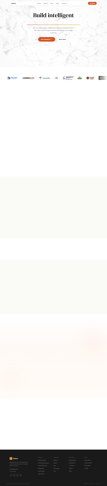

### Section Clips (screens/sections/)

*Clipped individual sections and components*

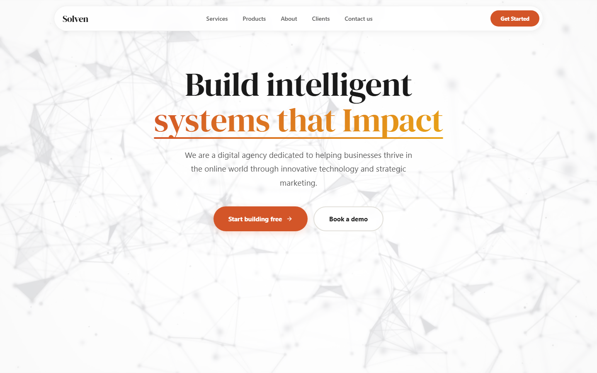

### Interaction States (screens/states/)

*Hover, focus, and active state captures*

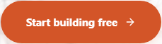

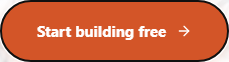

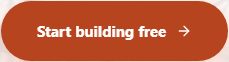

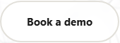

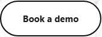

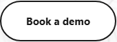

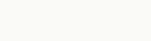

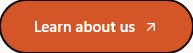


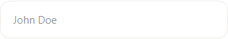

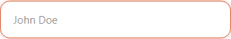


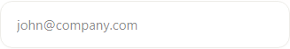

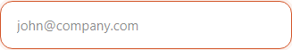


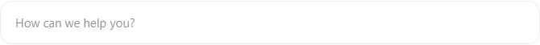

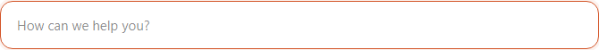


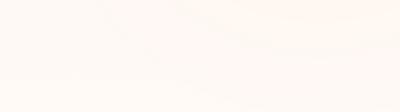

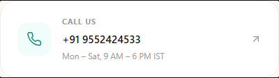

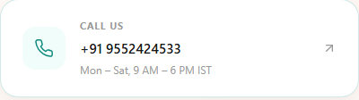

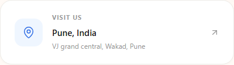

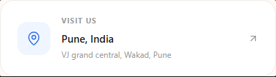

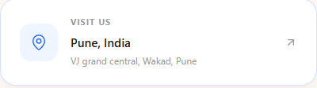

### Screenshot Index (screens/INDEX.md)

# Screenshot Index

## Scroll Journey

> Shows the cinematic state at each point of the page

| Scroll | Y Position | File |
|--------|-----------|------|
| 0% | 0px | `screens/scroll/scroll-000.png` |
| 17% | 957px | `screens/scroll/scroll-017.png` |
| 33% | 1857px | `screens/scroll/scroll-033.png` |
| 50% | 2814px | `screens/scroll/scroll-050.png` |
| 67% | 3770px | `screens/scroll/scroll-067.png` |
| 83% | 4670px | `screens/scroll/scroll-083.png` |
| 100% | 5627px | `screens/scroll/scroll-100.png` |

## Video First Frames

- Video 1 (background): `screens/scroll/video-1-frame.png`

## Pages

| Page | URL | File |
|------|-----|------|
| Solven Building Tomorrow's Technology | `https://solven.in/` | `screens/pages/home.png` |

## Sections

| Page | Section | File |
|------|---------|------|
| home | #1 (section) | `screens/sections/home-section-1.png` |

## Homepage Screenshots (screenshots/)


