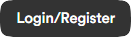
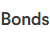
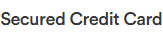
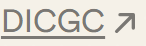
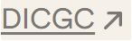

# stablemoney Design System

You are building UI for **stablemoney**. Dark-themed, cool palette, sans-serif typography (Circular Std), compact density on a 4px grid, expressive motion.

## Visual Reference

**IMPORTANT**: Study ALL screenshots below before writing any UI. Match colors, typography, spacing, layout, and motion exactly as shown.

### Homepage


### Scroll Journey (Cinematic Visual States)

> These screenshots capture the website at different scroll depths. The design changes dramatically as you scroll - each frame shows a different cinematic state. Replicate these exact visual transitions.

#### 0% - Hero / Above the fold


#### 17% - Mid-page at 17% scroll


#### 33% - Mid-page at 33% scroll


#### 50% - Mid-page at 50% scroll


#### 67% - Mid-page at 67% scroll


#### 83% - Mid-page at 83% scroll


#### 100% - Footer / End of page


> Read `references/DESIGN.md` for full token details. Read `references/ANIMATIONS.md` for motion specs. Read `references/LAYOUT.md` for layout structure. Read `references/COMPONENTS.md` for component patterns.

## Ultra Reference Files

This package includes extended documentation. **Read these files before implementing:**

| File | Contents |
|------|----------|
| `references/DESIGN.md` | Full design system tokens, colors, typography, spacing |
| `references/VISUAL_GUIDE.md` | **START HERE** - Master visual guide with all screenshots embedded |
| `references/ANIMATIONS.md` | CSS keyframes, scroll triggers, motion library stack, video specs |
| `references/LAYOUT.md` | Flex/grid containers, page structure, spacing relationships |
| `references/COMPONENTS.md` | DOM component patterns, HTML structure, class fingerprints |
| `references/INTERACTIONS.md` | Hover/focus states with before/after style diffs |
| `screens/scroll/` | 7 scroll journey screenshots showing cinematic states |

### Animation Stack Detected

- **Web Animations API (12 active)** - animation

## Design Philosophy

- **Layered depth** - use shadow tokens to create a sense of physical layering. Each elevation level has a specific shadow.
- **Gradient accents** - gradients are used thoughtfully for emphasis, not decoration.
- **Type pairing** - Circular Std for body/UI text, Roboto for headings/display. Never introduce a third typeface.
- **compact density** - 4px base grid. Every dimension is a multiple of 4.
- **cool palette** - the color temperature runs cool, matching the sans-serif typography.
- **Restrained accent** - `#a66cff` is the only pop of color. Used exclusively for CTAs, links, focus rings, and active states.
- **Expressive motion** - animations are an integral part of the experience. Use spring physics and layout animations.

## Color System

### Core Palette

| Role | Token | Hex | Use |
|------|-------|-----|-----|
| Background | `--background` | `#000000` | Page/app background |
| Surface | `--surface` | `#1a1a1a` | Cards, panels, modals |
| Text Primary | `--text-primary` | `#ffffff` | Headings, body text |
| Text Muted | `--text-muted` | `#685337` | Captions, placeholders |
| Accent | `--accent` | `#a66cff` | CTAs, links, focus rings |
| Border | `--border` | `#333333` | Dividers, card borders |

### Status Colors

| Status | Hex | Use |
|--------|-----|-----|
| Success | `#ecfdf3` | Confirmations, positive trends |
| Warning | `#ffd96d` | Caution states, pending items |

### Extended Palette

- `#916cff`
- **warning-bg:** `#fffcf0` - Warning banners, caution states
- **success:** `#12bf57` - Confirmations, positive trend indicators
- `#30291b`
- `#e4eaef` - Light surface or highlight color
- `#000042`
- **warning-border:** `#fdf5d3` - Warning banners, caution states
- **background:** `#09080c` - Deep background layer or shadow color

### CSS Variable Tokens

```css
--border-radius: 8px;
--normal-border: var(--gray4);
--success-border: hsl(145,92%,91%);
--info-border: hsl(221,91%,91%);
--warning-border: hsl(49,91%,91%);
--error-border: hsl(359,100%,94%);
--normal-border: hsl(0,0%,20%);
--normal-border: var(--gray3);
--normal-border: hsl(0,0%,20%);
--success-border: hsl(147,100%,12%);
--info-border: hsl(223,100%,12%);
--warning-border: hsl(60,100%,12%);
--error-border: hsl(357,89%,16%);
--sd-border-w-xs: calc(.3px*var(--sd-scale-factor,1));
--sd-border-w-sm: calc(.5px*var(--sd-scale-factor,1));
--sd-border-w-md: calc(1px*var(--sd-scale-factor,1));
--sd-border-color: var(--sd-black-10);
--sd-border-w-xs: calc(.3px*var(--sd-scale-factor,1));
--sd-border-w-sm: calc(.5px*var(--sd-scale-factor,1));
--sd-border-w-md: calc(1px*var(--sd-scale-factor,1));
```

## Typography

### Font Stack

- **Circular Std** - Heading 1, Heading 2, Heading 3
- **Roboto** - Body, Caption
- **SFMono-Regular** - Code

### Font Sources

```css
@font-face {
  font-family: "CircularStd";
  src: url("fonts/CircularStd-Regular.woff") format("woff");
  font-weight: 400;
}
@font-face {
  font-family: "RecklessNeue";
  src: url("fonts/RecklessNeue-Regular.woff2") format("woff2");
  font-weight: 400;
}
@font-face {
  font-family: "DentonTest";
  src: url("fonts/DentonTest-Regular.otf") format("truetype");
  font-weight: 400;
}
@font-face {
  font-family: "Denton";
  src: url("fonts/Denton-700.otf") format("truetype");
  font-weight: 700;
}
@font-face {
  font-family: "Copperplate";
  src: url("fonts/Copperplate-Regular.woff") format("woff");
  font-weight: 400;
}
@font-face {
  font-family: "Roboto";
  src: url("fonts/Roboto-Bold.ttf") format("truetype");
  font-weight: 700;
}
@font-face {
  font-family: "Roboto";
  src: url("fonts/Roboto-Regular.ttf") format("truetype");
  font-weight: 400;
}
```

### Type Scale

| Role | Family | Size | Weight |
|------|--------|------|--------|
| Heading 1 | Circular Std | 253px | 700 |
| Heading 2 | Circular Std | 180px | 700 |
| Heading 3 | Circular Std | 140px | 700 |
| Body | Roboto | 13px | 400 |
| Caption | Roboto | 16px | 400 |
| Code | SFMono-Regular | 14px | 400 |

### Typography Rules

- Body/UI: **Circular Std**, Headings: **Roboto** - these are the only display fonts
- Max 3-4 font sizes per screen
- Headings: weight 600-700, body: weight 400
- Use color and opacity for text hierarchy, not additional font sizes
- Line height: 1.5 for body, 1.2 for headings

## Spacing & Layout

### Base Grid: 4px

Every dimension (margin, padding, gap, width, height) must be a multiple of **4px**.

### Spacing Scale

`2, 4, 6, 8, 10, 12, 14, 16, 18, 20, 22, 24` px

### Spacing as Meaning

| Spacing | Use |
|---------|-----|
| 4-8px | Tight: related items (icon + label, avatar + name) |
| 12-16px | Medium: between groups within a section |
| 24-32px | Wide: between distinct sections |
| 48px+ | Vast: major page section breaks |

### Border Radius

Scale: `.25rem, .3125rem, .375rem, 1rem, 2px, 4px, 6px, 8px, 8.265px, 10px, 11px, 12px, 13px, 14px, 16px, 20px, 24px, 47px, 55px, 999px`
Default: `11px`

### Container

Max-width: `1000px`, centered with auto margins.

### Breakpoints

| Name | Value |
|------|-------|
| sm | 40rem |
| md | 48rem |
| lg | 64rem |
| xl | 80rem |
| 2xl | 96rem |
| xs | 471px |
| xs | 472px |
| sm | 500px |
| sm | 550px |
| sm | 600px |
| sm | 639px |
| sm | 640px |
| md | 699px |
| md | 700px |
| md | 750px |
| md | 757px |
| md | 768px |
| lg | 799px |
| lg | 800px |
| lg | 850px |
| lg | 851px |
| lg | 900px |
| lg | 961px |
| lg | 1000px |
| xl | 1074px |
| xl | 1279px |
| 2xl | 1430px |

Mobile-first: design for small screens, layer on responsive overrides.

## Component Patterns

### Card

```css
.card {
  background: #1a1a1a;
  border: 1px solid #333333;
  border-radius: 11px;
  padding: 16px;
  box-shadow: 0 0 0 1px rgb(var(--tw-prose-kbd-shadows)/10%),0 3px rgb(var(--tw-prose-kbd-shadows)/10%);
}
```

```html
<div class="card">
  <h3>Card Title</h3>
  <p>Card content goes here.</p>
</div>
```

### Button

```css
/* Primary */
.btn-primary {
  background: #a66cff;
  color: #ffffff;
  border-radius: 11px;
  padding: 8px 16px;
  font-weight: 500;
  transition: opacity 150ms ease;
}
.btn-primary:hover { opacity: 0.9; }

/* Ghost */
.btn-ghost {
  background: transparent;
  border: 1px solid #333333;
  color: #ffffff;
  border-radius: 11px;
  padding: 8px 16px;
}
```

```html
<button class="btn-primary">Get Started</button>
<button class="btn-ghost">Learn More</button>
```

### Input

```css
.input {
  background: #000000;
  border: 1px solid #333333;
  border-radius: 11px;
  padding: 8px 12px;
  color: #ffffff;
  font-size: 14px;
}
.input:focus { border-color: #a66cff; outline: none; }
```

```html
<input class="input" type="text" placeholder="Search..." />
```

### Badge / Chip

```css
.badge {
  display: inline-flex;
  align-items: center;
  padding: 4px 8px;
  border-radius: 9999px;
  font-size: 12px;
  font-weight: 500;
  background: #1a1a1a;
  color: #685337;
}
```

```html
<span class="badge">New</span>
<span class="badge">Beta</span>
```

### Modal / Dialog

```css
.modal-backdrop { background: rgba(0, 0, 0, 0.6); }
.modal {
  background: #1a1a1a;
  border: 1px solid #333333;
  border-radius: 999px;
  padding: 24px;
  max-width: 480px;
  width: 90vw;
  box-shadow: 0 4px 12px #0000001a;
}
```

```html
<div class="modal-backdrop">
  <div class="modal">
    <h2>Dialog Title</h2>
    <p>Dialog content.</p>
    <button class="btn-primary">Confirm</button>
    <button class="btn-ghost">Cancel</button>
  </div>
</div>
```

### Table

```css
.table { width: 100%; border-collapse: collapse; }
.table th {
  text-align: left;
  padding: 8px 12px;
  font-weight: 500;
  font-size: 12px;
  color: #685337;
  text-transform: uppercase;
  letter-spacing: 0.05em;
  border-bottom: 1px solid #333333;
}
.table td {
  padding: 12px;
  border-bottom: 1px solid #333333;
}
```

```html
<table class="table">
  <thead><tr><th>Name</th><th>Status</th><th>Date</th></tr></thead>
  <tbody>
    <tr><td>Item One</td><td>Active</td><td>Jan 1</td></tr>
    <tr><td>Item Two</td><td>Pending</td><td>Jan 2</td></tr>
  </tbody>
</table>
```

### Navigation

```css
.nav {
  display: flex;
  align-items: center;
  gap: 8px;
  padding: 12px 16px;
  border-bottom: 1px solid #333333;
}
.nav-link {
  color: #685337;
  padding: 8px 12px;
  border-radius: 11px;
  transition: color 150ms;
}
.nav-link:hover { color: #ffffff; }
.nav-link.active { color: #a66cff; }
```

```html
<nav class="nav">
  <a href="/" class="nav-link active">Home</a>
  <a href="/about" class="nav-link">About</a>
  <a href="/pricing" class="nav-link">Pricing</a>
  <button class="btn-primary" style="margin-left: auto">Get Started</button>
</nav>
```

### Extracted Components

These components were found in the codebase:

**Button** (`html`)
- Variants: `uy`

**Card** (`html`)
- Variants: `cell`, `shimmer`

**Navigation** (`html`)

**Badge** (`html`)

**Footer** (`html`)

## Page Structure

The following page sections were detected:

- **Hero** - Hero/banner section with headline and CTAs
- **Features** - Feature/benefit cards grid (18 items)
- **Faq** - FAQ/accordion section
- **Footer** - Page footer with links and info
- **Cta** - Call-to-action section
- **Testimonials** - Testimonials/reviews section
- **Navigation** - Top navigation bar (1 items)

When building pages, follow this section order and structure.

## Animation & Motion

This project uses **expressive motion**. Animations are part of the design language.

### CSS Animations

- `swipe-out`
- `sonner-fade-in`
- `sonner-fade-out`
- `sonner-spin`
- `svelte-13p1stj-pulse`

### Motion Tokens

- **Duration scale:** `.1s`, `.15s`, `.2s`, `.3s`, `.5s`, `1s`, `40s`, `50ms`, `75ms`, `100ms`, `200ms`, `300ms`, `320ms`, `400ms`, `500ms`, `5000000ms`
- **Easing functions:** `linear`, `ease-in-out`, `cubic-bezier(.32,.72,0,1)`, `cubic-bezier(.22,1,.36,1)`, `ease-out`, `ease`
- **Animated properties:** `transform`, `opacity`, `height`, `box-shadow`

### Motion Guidelines

- **Duration:** Use values from the duration scale above. Short (.1s) for micro-interactions, long (5000000ms) for page transitions
- **Easing:** Use `linear` as the default easing curve
- **Direction:** Elements enter from bottom/right, exit to top/left
- **Reduced motion:** Always respect `prefers-reduced-motion` - disable animations when set

## Dark Mode

This project supports **light and dark mode** via CSS variables.

### Token Mapping

| Variable | Light | Dark |
|----------|-------|------|
| `--background` | `0 0% 100%` | `255 20% 4%` |
| `--foreground` | `0 0% 0%` | `0 0% 100%` |
| `--card` | `0 0% 100%` | `0 0% 10%` |
| `--card-foreground` | `0 0% 0%` | `0 0% 100%` |
| `--primary` | `0 0% 0%` | `0 0% 100%` |
| `--primary-foreground` | `0 0% 100%` | `0 0% 0%` |
| `--destructive` | `0 72.2% 50.6%` | `0 100% 67%` |
| `--destructive-foreground` | `210 40% 98%` | `var(--foreground)` |
| `--ring` | `222.2 84% 4.9%` | `hsl(212.7,26.8%,83.9)` |

### Implementation

- Toggle via `.dark` class on `<html>` or `[data-theme="dark"]`
- Always use CSS variables for colors - never hardcode hex values
- Test both modes for contrast and readability

## Depth & Elevation

### Shadow Tokens

- Subtle: `0 0 0 2px #0006`
- Raised (cards, buttons): `0 0 0 1px rgb(var(--tw-prose-kbd-shadows)/10%),0 3px rgb(var(--tw-prose-kbd-shadows)/10%)`
- Raised (cards, buttons): `2px 0 5px #0000001a`
- Floating (dropdowns, popovers): `0 4px 12px #0000001a`
- Floating (dropdowns, popovers): `0 4px 12px #0000001a,0 0 0 2px #0003`
- Floating (dropdowns, popovers): `0 0 10px #29d,0 0 5px #29d`

### Z-Index Scale

`0, 1, 2, 5, 10, 20, 30, 50, 51, 98, 99, 100, 200, 1000, 1031, 9996, 9998, 9999, 10001, 10002, 999999999`

Use these exact values - never invent z-index values.

## Anti-Patterns (Never Do)

- **No blur effects** - no backdrop-blur, no filter: blur()
- **No zebra striping** - tables and lists use borders for separation
- **No invented colors** - every hex value must come from the palette above
- **No arbitrary spacing** - every dimension is a multiple of 4px
- **No extra fonts** - only Circular Std and Roboto and SFMono-Regular are allowed
- **No arbitrary border-radius** - use the scale: .25rem, .3125rem, .375rem, 1rem, 2px, 4px, 6px, 8px, 8.265px, 10px
- **No opacity for disabled states** - use muted colors instead

## Workflow

1. **Read** `references/DESIGN.md` before writing any UI code
2. **Pick colors** from the Color System section - never invent new ones
3. **Set typography** - Circular Std, Roboto, SFMono-Regular only, using the type scale
4. **Build layout** on the 4px grid - check every margin, padding, gap
5. **Match components** to patterns above before creating new ones
6. **Apply elevation** - use shadow tokens
7. **Validate** - every value traces back to a design token. No magic numbers.

## Brand Spec

- **Favicon:** `./favicon.png`
- **Site URL:** `https://stablemoney.in/`
- **Brand color:** `#a66cff`
- **Brand typeface:** Circular Std

## Quick Reference

```
Background:     #000000
Surface:        #1a1a1a
Text:           #ffffff / #685337
Accent:         #a66cff
Border:         #333333
Font:           Circular Std
Spacing:        4px grid
Radius:         11px
Components:     8 detected
```

## When to Trigger

Activate this skill when:
- Creating new components, pages, or visual elements for stablemoney
- Writing CSS, Tailwind classes, styled-components, or inline styles
- Building page layouts, templates, or responsive designs
- Reviewing UI code for design consistency
- The user mentions "stablemoney" design, style, UI, or theme
- Generating mockups, wireframes, or visual prototypes

---

# Full Reference Files

> Every output file is embedded below. Claude has full design system context from /skills alone.

## Design System Tokens (DESIGN.md)

# stablemoney DESIGN.md

> Auto-generated design system - reverse-engineered via static analysis by skillui.
> Frameworks: None detected
> Colors: 20 · Fonts: 3 · Components: 8
> Icon library: not detected · State: not detected
> Primary theme: dark · Dark mode toggle: yes · Motion: expressive

## Visual Reference

**Match this design exactly** - study colors, fonts, spacing, and component shapes before writing any UI code.


---

## 1. Visual Theme & Atmosphere

This is a **dark-themed** interface with a cool tone. Depth is expressed through layered shadows and subtle surface color variation. Typography pairs **Roboto** for display/headings with **Circular Std** for body text, creating clear visual hierarchy through type contrast. Spacing follows a **4px base grid** (compact density), with scale: 2, 4, 6, 8, 10, 12, 14, 16px. The accent color **#a66cff** anchors interactive elements (buttons, links, focus rings). Motion is expressive - spring physics, layout animations, and staggered reveals are part of the visual language.

---

## 2. Color Palette & Roles

| Token | Hex | Role | Use |
|---|---|---|---|
| tile-color | `#000000` | background | Page background, darkest surface |
| card | `#1a1a1a` | surface | Card and panel backgrounds |
| theme-color | `#ffffff` | text-primary | Headings and body text |
| text-muted | `#685337` | text-muted | Captions, placeholders, secondary info |
| normal-border | `#333333` | border | Dividers, card borders, outlines |
| accent | `#a66cff` | accent | CTAs, links, focus rings, active states |
| success-bg | `#ecfdf3` | success | Success states, positive indicators |
| warning | `#ffd96d` | warning | Warning states, caution indicators |
| info | `#916cff` | info | Informational highlights |
| warning-bg | `#fffcf0` | unknown | Palette color |
| success | `#12bf57` | unknown | Palette color |
| unknown | `#30291b` | unknown | Palette color |
| unknown | `#e4eaef` | unknown | Palette color |
| unknown | `#000042` | unknown | Palette color |
| warning-border | `#fdf5d3` | unknown | Palette color |
| background | `#09080c` | unknown | Palette color |
| info-text | `#0973dc` | unknown | Palette color |
| info-bg | `#000d1f` | unknown | Palette color |
| unknown | `#7c7d25` | unknown | Palette color |
| unknown | `#f4f0ff` | unknown | Palette color |

### Dark Mode Token Mapping

| Variable | Light | Dark |
|---|---|---|
| `--background` | `0 0% 100%` | `255 20% 4%` |
| `--foreground` | `0 0% 0%` | `0 0% 100%` |
| `--card` | `0 0% 100%` | `0 0% 10%` |
| `--card-foreground` | `0 0% 0%` | `0 0% 100%` |
| `--primary` | `0 0% 0%` | `0 0% 100%` |
| `--primary-foreground` | `0 0% 100%` | `0 0% 0%` |
| `--destructive` | `0 72.2% 50.6%` | `0 100% 67%` |
| `--destructive-foreground` | `210 40% 98%` | `var(--foreground)` |
| `--ring` | `222.2 84% 4.9%` | `hsl(212.7,26.8%,83.9)` |

### CSS Variable Tokens

```css
--border-radius: 8px;
--normal-border: var(--gray4);
--success-border: hsl(145,92%,91%);
--info-border: hsl(221,91%,91%);
--warning-border: hsl(49,91%,91%);
--error-border: hsl(359,100%,94%);
--normal-border: hsl(0,0%,20%);
--normal-border: var(--gray3);
--normal-border: hsl(0,0%,20%);
--success-border: hsl(147,100%,12%);
--info-border: hsl(223,100%,12%);
--warning-border: hsl(60,100%,12%);
--error-border: hsl(357,89%,16%);
--tw-border-style: solid;
--sd-border-w-xs: calc(.3px*var(--sd-scale-factor,1));
--sd-border-w-sm: calc(.5px*var(--sd-scale-factor,1));
--sd-border-w-md: calc(1px*var(--sd-scale-factor,1));
--sd-border-color: var(--sd-black-10);
--sd-border-w-xs: calc(.3px*var(--sd-scale-factor,1));
--sd-border-w-sm: calc(.5px*var(--sd-scale-factor,1));
```


---

## 3. Typography Rules

**Font Stack:**
- **Circular Std** - Heading 1, Heading 2, Heading 3
- **Roboto** - Body, Caption
- **SFMono-Regular** - Code

**Font Sources:**

```css
@font-face {
  font-family: "CircularStd";
  src: url("fonts/CircularStd-Regular.woff") format("woff");
  font-weight: 400;
}
@font-face {
  font-family: "RecklessNeue";
  src: url("fonts/RecklessNeue-Regular.woff2") format("woff2");
  font-weight: 400;
}
@font-face {
  font-family: "DentonTest";
  src: url("fonts/DentonTest-Regular.otf") format("truetype");
  font-weight: 400;
}
@font-face {
  font-family: "Denton";
  src: url("fonts/Denton-700.otf") format("truetype");
  font-weight: 700;
}
@font-face {
  font-family: "Copperplate";
  src: url("fonts/Copperplate-Regular.woff") format("woff");
  font-weight: 400;
}
@font-face {
  font-family: "Roboto";
  src: url("fonts/Roboto-Bold.ttf") format("truetype");
  font-weight: 700;
}
@font-face {
  font-family: "Roboto";
  src: url("fonts/Roboto-Regular.ttf") format("truetype");
  font-weight: 400;
}
```

| Role | Font | Size | Weight |
|---|---|---|---|
| Heading 1 | Circular Std | 253px | 700 |
| Heading 2 | Circular Std | 180px | 700 |
| Heading 3 | Circular Std | 140px | 700 |
| Body | Roboto | 13px | 400 |
| Caption | Roboto | 16px | 400 |
| Code | SFMono-Regular | 14px | 400 |

**Typographic Rules:**
- Limit to 3 font families max per screen
- Use **Circular Std** for body/UI text, **Roboto** for display/headings
- Maintain consistent hierarchy: no more than 3-4 font sizes per screen
- Headings use bold (600-700), body uses regular (400)
- Line height: 1.5 for body text, 1.2 for headings
- Use color and opacity for secondary hierarchy, not additional font sizes


---

## 4. Component Stylings

### Layout (1)

**Footer** - `html`

### Navigation (1)

**Navigation** - `html`

### Data Display (2)

**Card** - `html`
- Variants: `cell`, `shimmer`

**Badge** - `html`

### Data Input (1)

**Button** - `html`
- Variants: `uy`
- Animation: 

### Media (3)

**Image** - `html`

**Icon** - `html`

**Map/Canvas** - `html`


---

## 5. Layout Principles

- **Base spacing unit:** 4px
- **Spacing scale:** 2, 4, 6, 8, 10, 12, 14, 16, 18, 20, 22, 24
- **Border radius:** .25rem, .3125rem, .375rem, 1rem, 2px, 4px, 6px, 8px, 8.265px, 10px, 11px, 12px, 13px, 14px, 16px, 20px, 24px, 47px, 55px, 999px
- **Max content width:** 1000px

**Spacing as Meaning:**
| Spacing | Use |
|---|---|
| 4-8px | Tight: related items within a group |
| 12-16px | Medium: between groups |
| 24-32px | Wide: between sections |
| 48px+ | Vast: major section breaks |


---

## 6. Depth & Elevation

### Flat - subtle depth hints

- `0 0 0 2px #0006`

### Raised - cards, buttons, interactive elements

- `0 0 0 1px rgb(var(--tw-prose-kbd-shadows)/10%),0 3px rgb(var(--tw-prose-kbd-shadows)/10%)`
- `2px 0 5px #0000001a`

### Floating - dropdowns, popovers, modals

- `0 4px 12px #0000001a`
- `0 4px 12px #0000001a,0 0 0 2px #0003`
- `0 0 10px #29d,0 0 5px #29d`

### Overlay - full-screen overlays, top-level dialogs

- `inset 0 0 0 1000px #fff`
- `0 24px 48px -12px #68533738,0 8px 16px -4px #68533724`
- `0 24px 48px -12px #00000040`

### Z-Index Scale

`0, 1, 2, 5, 10, 20, 30, 50, 51, 98, 99, 100, 200, 1000, 1031, 9996, 9998, 9999, 10001, 10002, 999999999`


---

## 7. Animation & Motion

This project uses **expressive motion**. Animations are an integral part of the experience.

### CSS Animations

- `@keyframes swipe-out`
- `@keyframes sonner-fade-in`
- `@keyframes sonner-fade-out`
- `@keyframes sonner-spin`
- `@keyframes svelte-13p1stj-pulse`
- `@keyframes shine`
- `@keyframes caret-blink`
- `@keyframes spin`

### Animated Components

- **Button**: 

### Motion Guidelines

- Duration: 150-300ms for micro-interactions, 300-500ms for page transitions
- Easing: `ease-out` for enters, `ease-in` for exits
- Always respect `prefers-reduced-motion`


---

## 8. Do's and Don'ts

### Do's

- Use `#a66cff` for interactive elements (buttons, links, focus rings)
- Use `#000000` as the primary page background
- Pair **Circular Std** (body) with **Roboto** (display) - these are the only allowed fonts
- Follow the **4px** spacing grid for all margins, padding, and gaps
- Use the defined shadow tokens for elevation - see Section 6
- Use border-radius from the scale: .25rem, .3125rem, .375rem, 1rem, 2px
- Reuse existing components from Section 4 before creating new ones
- Always use CSS variables for colors - never hardcode hex
- Test both light and dark modes for contrast

### Don'ts

- Don't introduce colors outside this palette - extend the design tokens first
- Don't introduce additional font families beyond Circular Std and Roboto and SFMono-Regular
- Don't use arbitrary spacing values - stick to multiples of 4px
- Don't create custom box-shadow values outside the system tokens
- Don't use arbitrary border-radius values - pick from the defined scale
- Don't duplicate component patterns - check Section 4 first
- Don't use backdrop-blur or blur effects

### Anti-Patterns (detected from codebase)

- No blur or backdrop-blur effects
- No zebra striping on tables/lists


---

## 9. Responsive Behavior

| Name | Value | Source |
|---|---|---|
| sm | 40rem | css |
| md | 48rem | css |
| lg | 64rem | css |
| xl | 80rem | css |
| 2xl | 96rem | css |
| xs | 471px | css |
| xs | 472px | css |
| sm | 500px | css |
| sm | 550px | css |
| sm | 600px | css |
| sm | 639px | css |
| sm | 640px | css |
| md | 699px | css |
| md | 700px | css |
| md | 750px | css |
| md | 757px | css |
| md | 768px | css |
| lg | 799px | css |
| lg | 800px | css |
| lg | 850px | css |
| lg | 851px | css |
| lg | 900px | css |
| lg | 961px | css |
| lg | 1000px | css |
| xl | 1074px | css |
| xl | 1279px | css |
| 2xl | 1430px | css |

**Approach:** Use `@media (min-width: ...)` queries matching the breakpoints above.


---

## 10. Agent Prompt Guide

Use these as starting points when building new UI:

### Build a Card

```
Background: #1a1a1a
Border: 1px solid #333333
Radius: 11px
Padding: 16px
Font: Circular Std
Use shadow tokens from Section 6.
```

### Build a Button

```
Primary: bg #a66cff, text white
Ghost: bg transparent, border #333333
Padding: 8px 16px
Radius: 11px
Hover: opacity 0.9 or lighter shade
Focus: ring with #a66cff
```

### Build a Page Layout

```
Background: #000000
Max-width: 1000px, centered
Grid: 4px base
Responsive: mobile-first, breakpoints from Section 9
```

### Build a Stats Card

```
Surface: #1a1a1a
Label: #685337 (muted, 12px, uppercase)
Value: #ffffff (primary, 24-32px, bold)
Status: use success/warning/danger from Section 2
```

### Build a Form

```
Input bg: #000000
Input border: 1px solid #333333
Focus: border-color #a66cff
Label: #685337 12px
Spacing: 16px between fields
Radius: 11px
```

### General Component

```
1. Read DESIGN.md Sections 2-6 for tokens
2. Colors: only from palette
3. Font: Circular Std, type scale from Section 3
4. Spacing: 4px grid
5. Components: match patterns from Section 4
6. Elevation: shadow tokens
```

## Visual Guide - Screenshots (VISUAL_GUIDE.md)

# stablemoney - Visual Guide

> Master visual reference. Study every screenshot carefully before implementing any UI.
> Match colors, layout, typography, spacing, and motion states exactly.

**Motion Stack:** **Web Animations API (12 active)**

**WebGL/3D:** Detected (1 canvas elements) - replicate with Three.js or CSS 3D transforms

## Scroll Journey

The page has cinematic scroll animations. Each screenshot below shows the exact visual state at that scroll depth.
**Replicate these transitions precisely** - the design changes dramatically as you scroll.

### Hero - Above the fold

*Scroll position: 0px of 7212px total*


### 17% scroll depth

*Scroll position: 1073px of 7212px total*


### 33% scroll depth

*Scroll position: 2083px of 7212px total*


### 50% scroll depth

*Scroll position: 3156px of 7212px total*


### 67% scroll depth

*Scroll position: 4229px of 7212px total*


### 83% scroll depth

*Scroll position: 5239px of 7212px total*


### Footer - End of page

*Scroll position: 6312px of 7212px total*


## Full Page Screenshots

### Stable Money - Earn Up to 8.30% with High-Yield Fixed Deposits

*URL: `https://stablemoney.in/`*


### Credit Card Against FD – Build Credit with Secured Cards | Stable Money

*URL: `https://stablemoney.in/credit-card`*


### Open Shivalik SF Bank Fixed Deposit, Invest in Shivalik Small Finance Bank FD Online

*URL: `https://stablemoney.in/fixed-deposit/shivalik-small-finance-bank`*


### Open Suryoday SF Bank Fixed Deposit, Invest in Suryoday Small Finance Bank FD Online

*URL: `https://stablemoney.in/fixed-deposit/suryoday-small-finance-bank`*


### Open Utkarsh SF Bank Fixed Deposit, Invest in Utkarsh SF Bank FD Online

*URL: `https://stablemoney.in/fixed-deposit/utkarsh-small-finance-bank`*


## Section Screenshots

Clipped sections showing individual components in context.

### Section 1 - `section`

*1440×900px*


### Section 3 - `[class*="hero"]`

*1440×472px*


## Animations & Motion (ANIMATIONS.md)

# Animation Reference

> Cinematic motion design extracted from live DOM. Follow these specs exactly to recreate the experience.

## Motion Technology Stack

| Library | Type | Notes |
|---------|------|-------|
| **Web Animations API (12 active)** | animation |  |
| Canvas (1 elements) | WebGL/3D | WebGL context detected - likely Three.js or custom shader |

## Scroll Journey

The page is **7,212px** tall. Each frame below shows what the user sees at that scroll depth.

> **Use these screenshots to understand WHAT animates, WHEN it animates, and HOW it moves.**

### 0% - Top / Hero
Scroll position: 0px


### 17% - Opening Section
Scroll position: 1,073px


### 33% - First Feature Section
Scroll position: 2,083px


### 50% - Mid-Page
Scroll position: 3,156px


### 67% - Lower Content
Scroll position: 4,229px


### 83% - Near Footer
Scroll position: 5,239px


### 100% - Bottom / Footer
Scroll position: 6,312px


## CSS Keyframes (36 extracted)

### `@keyframes svelte-1s476lo-moveSlides`

Duration: `60s` · Easing: `linear` · Delay: `0s` · Iteration: `infinite` · Fill: `none`

Used by: `.bank-row-container-normal.svelte-1s476lo`, `.bank-row-container-reverse.svelte-1s476lo`

```css
@keyframes svelte-1s476lo-moveSlides {
  0% {
    transform: translate(0px);
  }
  100% {
    transform: translate(-50%);
  }
}
```

> Transform/motion animation

### `@keyframes swipe-out`

Duration: `0.2s` · Easing: `ease-out` · Delay: `0s` · Iteration: `1` · Fill: `forwards`

Used by: `[data-sonner-toast][data-swipe-out="true"][data-y-position="bottom"], [data-sonn`

```css
@keyframes swipe-out {
  0% {
    transform: translateY(calc(var(--lift) * var(--offset) + var(--swipe-amount)));
    opacity: 1;
  }
  100% {
    transform: translateY(calc(var(--lift) * var(--offset) + var(--swipe-amount) + var(--lift) * -100%));
    opacity: 0;
  }
}
```

> Fade + motion enter animation

### `@keyframes sonner-fade-in`

Duration: `0.3s` · Easing: `ease` · Delay: `0s` · Iteration: `1` · Fill: `forwards`

Used by: `:where([data-sonner-toast][data-promise="true"]) :where([data-icon]) > svg`

```css
@keyframes sonner-fade-in {
  0% {
    opacity: 0;
    transform: scale(0.8);
  }
  100% {
    opacity: 1;
    transform: scale(1);
  }
}
```

> Fade + motion enter animation

### `@keyframes sonner-fade-out`

Duration: `0.2s` · Easing: `ease` · Delay: `0s` · Iteration: `1` · Fill: `forwards`

Used by: `.sonner-loading-wrapper[data-visible="false"]`

```css
@keyframes sonner-fade-out {
  0% {
    opacity: 1;
    transform: scale(1);
  }
  100% {
    opacity: 0;
    transform: scale(0.8);
  }
}
```

> Fade + motion enter animation

### `@keyframes sonner-spin`

Duration: `1.2s` · Easing: `linear` · Delay: `0s` · Iteration: `infinite` · Fill: `none`

Used by: `.sonner-loading-bar`

```css
@keyframes sonner-spin {
  0% {
    opacity: 1;
  }
  100% {
    opacity: 0.15;
  }
}
```

> Opacity fade

### `@keyframes svelte-13p1stj-pulse`

Duration: `1.8s` · Easing: `ease-in-out` · Delay: `0s` · Iteration: `infinite` · Fill: `none`

Used by: `.pulse-dot.svelte-13p1stj`

```css
@keyframes svelte-13p1stj-pulse {
  0%, 100% {
    opacity: 1;
  }
  50% {
    opacity: 0.3;
  }
}
```

> Opacity fade

### `@keyframes nprogress-spinner`

Duration: `0.4s` · Easing: `linear` · Delay: `0s` · Iteration: `infinite` · Fill: `none`

Used by: `#nprogress .spinner-icon`

```css
@keyframes nprogress-spinner {
  0% {
    transform: rotate(0deg);
  }
  100% {
    transform: rotate(360deg);
  }
}
```

> Transform/motion animation

### `@keyframes nprogress-spinner`

Duration: `0.4s` · Easing: `linear` · Delay: `0s` · Iteration: `infinite` · Fill: `none`

Used by: `#nprogress .spinner-icon`

```css
@keyframes nprogress-spinner {
  0% {
    transform: rotate(0deg);
  }
  100% {
    transform: rotate(360deg);
  }
}
```

> Transform/motion animation

### `@keyframes svelte-ydjd51-fade-in`

Duration: `0.21s, 0.3s` · Easing: `cubic-bezier(0, 0, 0.2, 1), cubic-bezier(0.4, 0, 0.2, 1)` · Delay: `90ms, 0s` · Iteration: `1, 1` · Fill: `both, both`

Used by: `:root::view-transition-new(root)`

```css
@keyframes svelte-ydjd51-fade-in {
  0% {
    opacity: 0;
  }
}
```

> Opacity fade

### `@keyframes svelte-ydjd51-fade-out`

Duration: `90ms, 0.3s` · Easing: `cubic-bezier(0.4, 0, 1, 1), cubic-bezier(0.4, 0, 0.2, 1)` · Delay: `0s, 0s` · Iteration: `1, 1` · Fill: `both, both`

Used by: `:root::view-transition-old(root)`

```css
@keyframes svelte-ydjd51-fade-out {
  100% {
    opacity: 0;
  }
}
```

> Opacity fade

### `@keyframes svelte-ydjd51-slide-from-right`

Duration: `0.21s, 0.3s` · Easing: `cubic-bezier(0, 0, 0.2, 1), cubic-bezier(0.4, 0, 0.2, 1)` · Delay: `90ms, 0s` · Iteration: `1, 1` · Fill: `both, both`

Used by: `:root::view-transition-new(root)`

```css
@keyframes svelte-ydjd51-slide-from-right {
  0% {
    transform: translate(30px);
  }
}
```

> Transform/motion animation

### `@keyframes svelte-ydjd51-slide-to-left`

Duration: `90ms, 0.3s` · Easing: `cubic-bezier(0.4, 0, 1, 1), cubic-bezier(0.4, 0, 0.2, 1)` · Delay: `0s, 0s` · Iteration: `1, 1` · Fill: `both, both`

Used by: `:root::view-transition-old(root)`

```css
@keyframes svelte-ydjd51-slide-to-left {
  100% {
    transform: translate(-30px);
  }
}
```

> Transform/motion animation

### `@keyframes svelte-1orvz8a-spin`

Duration: `1s` · Easing: `linear` · Delay: `0s` · Iteration: `infinite` · Fill: `none`

Used by: `.spinner.svelte-1orvz8a`

```css
@keyframes svelte-1orvz8a-spin {
  0% {
    transform: rotate(0deg);
  }
  100% {
    transform: rotate(360deg);
  }
}
```

> Transform/motion animation

### `@keyframes svelte-1orvz8a-run`

Duration: `2.5s` · Easing: `ease` · Delay: `0s` · Iteration: `infinite` · Fill: `none`

Used by: `.shimmer.svelte-1orvz8a`

```css
@keyframes svelte-1orvz8a-run {
  0% {
    transform: translate(0px);
  }
  100% {
    transform: translate(var(--translate-width));
  }
}
```

> Transform/motion animation

### `@keyframes svelte-1sn02pw-slide-in-right`

Duration: `0.5s` · Easing: `ease` · Delay: `0s` · Iteration: `1` · Fill: `none`

Used by: `.mobile-content.svelte-1sn02pw`

```css
@keyframes svelte-1sn02pw-slide-in-right {
  0% {
    transform: translate(100%);
    opacity: 0;
  }
  100% {
    transform: translate(0px);
    opacity: 1;
  }
}
```

> Fade + motion enter animation

### `@keyframes fadeIn`

Used by: `[data-vaul-overlay][data-vaul-snap-points="false"][data-state="open"]`

```css
@keyframes fadeIn {
  0% {
    opacity: 0;
  }
  100% {
    opacity: 1;
  }
}
```

> Opacity fade

### `@keyframes fadeOut`

Used by: `[data-vaul-overlay][data-state="closed"]`

```css
@keyframes fadeOut {
  100% {
    opacity: 0;
  }
}
```

> Opacity fade

### `@keyframes slideFromBottom`

Used by: `[data-vaul-drawer][data-vaul-snap-points="false"][data-vaul-drawer-direction="bo`

```css
@keyframes slideFromBottom {
  0% {
    transform: translate3d(0,var(--initial-transform, 100%),0);
  }
  100% {
    transform: translateZ(0px);
  }
}
```

> Transform/motion animation

### `@keyframes slideToBottom`

Used by: `[data-vaul-drawer][data-vaul-snap-points="false"][data-vaul-drawer-direction="bo`

```css
@keyframes slideToBottom {
  100% {
    transform: translate3d(0,var(--initial-transform, 100%),0);
  }
}
```

> Transform/motion animation

### `@keyframes slideFromTop`

Used by: `[data-vaul-drawer][data-vaul-snap-points="false"][data-vaul-drawer-direction="to`

```css
@keyframes slideFromTop {
  0% {
    transform: translate3d(0,calc(var(--initial-transform, 100%) * -1),0);
  }
  100% {
    transform: translateZ(0px);
  }
}
```

> Transform/motion animation

### `@keyframes slideToTop`

Used by: `[data-vaul-drawer][data-vaul-snap-points="false"][data-vaul-drawer-direction="to`

```css
@keyframes slideToTop {
  100% {
    transform: translate3d(0,calc(var(--initial-transform, 100%) * -1),0);
  }
}
```

> Transform/motion animation

### `@keyframes slideFromLeft`

Used by: `[data-vaul-drawer][data-vaul-snap-points="false"][data-vaul-drawer-direction="le`

```css
@keyframes slideFromLeft {
  0% {
    transform: translate3d(calc(var(--initial-transform, 100%) * -1),0,0);
  }
  100% {
    transform: translateZ(0px);
  }
}
```

> Transform/motion animation

### `@keyframes slideToLeft`

Used by: `[data-vaul-drawer][data-vaul-snap-points="false"][data-vaul-drawer-direction="le`

```css
@keyframes slideToLeft {
  100% {
    transform: translate3d(calc(var(--initial-transform, 100%) * -1),0,0);
  }
}
```

> Transform/motion animation

### `@keyframes slideFromRight`

Used by: `[data-vaul-drawer][data-vaul-snap-points="false"][data-vaul-drawer-direction="ri`

```css
@keyframes slideFromRight {
  0% {
    transform: translate3d(var(--initial-transform, 100%),0,0);
  }
  100% {
    transform: translateZ(0px);
  }
}
```

> Transform/motion animation

### `@keyframes slideToRight`

Used by: `[data-vaul-drawer][data-vaul-snap-points="false"][data-vaul-drawer-direction="ri`

```css
@keyframes slideToRight {
  100% {
    transform: translate3d(var(--initial-transform, 100%),0,0);
  }
}
```

> Transform/motion animation

### `@keyframes svelte-lisx3c-gradientRotate`

Duration: `10s` · Easing: `linear` · Delay: `0s` · Iteration: `infinite` · Fill: `none`

Used by: `.slantedDiv.svelte-lisx3c`

```css
@keyframes svelte-lisx3c-gradientRotate {
  0% {
    background-position-x: 0%;
    background-position-y: 50%;
  }
  50% {
    background-position-x: 100%;
    background-position-y: 50%;
  }
  100% {
    background-position-x: 0%;
    background-position-y: 50%;
  }
}
```

> Background color/gradient shift · Background position (shimmer/scroll)

### `@keyframes svelte-sot3qq-shine`

Duration: `2s` · Easing: `ease` · Delay: `0s` · Iteration: `infinite` · Fill: `none`

Used by: `.new-tag.svelte-sot3qq .shine:where(.svelte-sot3qq)`

```css
@keyframes svelte-sot3qq-shine {
  0% {
    left: -10px;
  }
  100% {
    left: 28px;
  }
}
```

### `@keyframes svelte-kbtnuy-shine`

Duration: `2s` · Easing: `ease` · Delay: `0s` · Iteration: `infinite` · Fill: `none`

Used by: `.new-tag.svelte-kbtnuy .shine:where(.svelte-kbtnuy)`

```css
@keyframes svelte-kbtnuy-shine {
  0% {
    left: -10px;
  }
  100% {
    left: 28px;
  }
}
```

### `@keyframes svelte-75itld-stat-pulse`

Duration: `1.6s` · Easing: `ease-in-out` · Delay: `0s` · Iteration: `infinite` · Fill: `none`

Used by: `.live-dot.svelte-75itld`

```css
@keyframes svelte-75itld-stat-pulse {
  0%, 100% {
    opacity: 0.45;
    transform: scale(0.85);
  }
  50% {
    opacity: 1;
    transform: scale(1.1);
  }
}
```

> Fade + motion enter animation

### `@keyframes svelte-cy0ia1-gradientRotate`

Duration: `10s` · Easing: `linear` · Delay: `0s` · Iteration: `infinite` · Fill: `none`

Used by: `.slanted-div.svelte-cy0ia1`

```css
@keyframes svelte-cy0ia1-gradientRotate {
  0% {
    background-position-x: 0%;
    background-position-y: 50%;
  }
  50% {
    background-position-x: 100%;
    background-position-y: 50%;
  }
  100% {
    background-position-x: 0%;
    background-position-y: 50%;
  }
}
```

> Background color/gradient shift · Background position (shimmer/scroll)

### `@keyframes svelte-131oa78-moveSlidesLeft`

Duration: `80s` · Easing: `linear` · Delay: `0s` · Iteration: `infinite` · Fill: `none`

Used by: `.TestimonialRowContainer.svelte-131oa78`

```css
@keyframes svelte-131oa78-moveSlidesLeft {
  0% {
    transform: translate(0px);
  }
  100% {
    transform: translate(-50%);
  }
}
```

> Transform/motion animation

### `@keyframes svelte-efa5u5-shimmer`

Duration: `1.5s` · Easing: `ease` · Delay: `0s` · Iteration: `infinite` · Fill: `none`

Used by: `.shimmer-bg.svelte-efa5u5`

```css
@keyframes svelte-efa5u5-shimmer {
  0% {
    background-position-x: -200px;
    background-position-y: 0px;
  }
  100% {
    background-position-x: calc(100% + 200px);
    background-position-y: 0px;
  }
}
```

> Background color/gradient shift · Background position (shimmer/scroll)

### `@keyframes spin`

```css
@keyframes spin {
  100% {
    transform: rotate(360deg);
  }
}
```

> Transform/motion animation

### `@keyframes pulse`

```css
@keyframes pulse {
  50% {
    opacity: 0.5;
  }
}
```

> Opacity fade

### `@keyframes fake-animation`

```css
@keyframes fake-animation {
}
```

### `@keyframes svelte-qtyrkc-fadeSlideIn`

```css
@keyframes svelte-qtyrkc-fadeSlideIn {
  0% {
    opacity: 0;
    transform: translateY(20px);
  }
  100% {
    opacity: 1;
    transform: translateY(0px);
  }
}
```

> Fade + motion enter animation

## Motion Tokens (CSS Variables)

### Duration Tokens

```css
--default-transition-duration: .15s;
```

### Easing Tokens

```css
--default-transition-timing-function: cubic-bezier(.4,0,.2,1);
--ease-in: cubic-bezier(.4,0,1,1);
--ease-out: cubic-bezier(0,0,.2,1);
--ease-in-out: cubic-bezier(.4,0,.2,1);
```

## Global Transition Declarations

These `transition` values were extracted from CSS rules across the site:

```css
transition: transform 0.4s, opacity 0.4s, height 0.4s, box-shadow 0.2s;
transition: opacity 0.4s, box-shadow 0.2s;
transition: opacity 0.1s, background 0.2s, border-color 0.2s;
transition: opacity 0.4s;
transition: transform 0.5s, opacity 0.2s;
transition: opacity 0.2s, transform 0.2s;
transition: transform 0.5s cubic-bezier(0.32, 0.72, 0, 1);
transition: opacity 0.5s cubic-bezier(0.32, 0.72, 0, 1);
transition: background 0.2s;
transition: transform 0.32s cubic-bezier(0.22, 1, 0.36, 1);
transition: scale 0.32s cubic-bezier(0.22, 1, 0.36, 1);
```

## How to Recreate This Motion Design

### Step 1 - Install Dependencies

```bash
```

### Step 2 - Scroll-Reveal Pattern

Elements that animate into view follow this pattern:

```css
/* Initial hidden state */
.reveal {
  opacity: 0;
  transform: translateY(40px);
  transition: opacity .15s cubic-bezier(.4,0,.2,1),
              transform .15s cubic-bezier(.4,0,.2,1);
}
.reveal.visible {
  opacity: 1;
  transform: translateY(0);
}
```

### Step 3 - Key Motion Principles

- **WebGL/3D layer detected** - product visualizations use Three.js or custom WebGL. Use `<canvas>` with Three.js for 3D product renders
- **Canvas elements (1)** - animated via requestAnimationFrame loop. Use canvas for particle effects, gradient animations, and WebGL scenes
- **Duration scale:** `.15s` · `0.4s` · `0.2s` - use these values, never invent new durations
- **Always add** `@media (prefers-reduced-motion: reduce) { * { animation-duration: 0.01ms !important; transition-duration: 0.01ms !important; } }`

### Step 4 - Scroll Journey Reference

Match what happens at each scroll position:

- **0%** (`0px`) → `screens/scroll/scroll-000.png`
- **17%** (`1073px`) → `screens/scroll/scroll-017.png`
- **33%** (`2083px`) → `screens/scroll/scroll-033.png`
- **50%** (`3156px`) → `screens/scroll/scroll-050.png`
- **67%** (`4229px`) → `screens/scroll/scroll-067.png`
- **83%** (`5239px`) → `screens/scroll/scroll-083.png`
- **100%** (`6312px`) → `screens/scroll/scroll-100.png`

## Layout & Grid (LAYOUT.md)

# Layout Reference

> Auto-extracted from live DOM. Use this to understand how the site is structured spatially.

## Spacing System

**Base grid:** 4px

**Scale:** `2, 4, 6, 8, 10, 12, 14, 16, 18, 20, 22, 24, 26, 28, 30` px

| Spacing | Semantic Use |
|---------|-------------|
| 4px | Tight - within a component |
| 8px | Medium - between sibling items |
| 16px | Wide - between sections |
| 32px | Vast - major section breaks |

## Flex Layouts

| Element | Direction | Justify | Align | Gap | Children |
|---------|-----------|---------|-------|-----|----------|
| `div.qr-box.flex` | column | - | - | 6px | 2 |
| `div.flex.w-full` | column | - | center | - | 8 |
| `section.hero.svelte-qtyrkc` | row | center | - | - | 3 |
| `div.slant-dotted-background.flex` | column | center | - | 56px | 2 |
| `div.m-auto.box-border` | column | start | center | - | 1 |
| `div.compare-wrapper.svelte-1s476lo` | column | - | center | 80px | 3 |
| `div.flex.w-full` | column | - | center | - | 6 |
| `div.flex.items-center` | row | center | center | 16px | 1 |
| `div.flex.flex-col` | column | - | - | 80px | 3 |
| `div.twitter-testimonial-container.svelte-131oa78` | column | - | - | 28px | 2 |
| `div.fixed-header-wrapper.flex` | column | - | center | - | 2 |
| `div.flex.flex-col` | column | - | - | - | 2 |
| `div.mx-auto.flex` | row | - | - | 24px | 3 |
| `div.flex.flex-col` | column | - | - | 20px | 3 |
| `div.flex.flex-col` | column | - | - | 80px | 2 |

## Grid Layouts

| Element | Template Columns | Gap | Children |
|---------|-----------------|-----|----------|
| `div.cards-container.svelte-1feqift` | `294px 294px 294px 294px` | 56px | 4 |

## Structural Containers

### `<section>` (`section.hero.svelte-qtyrkc`)

```
display:          flex
flex-direction:   row
justify-content:  center
align-items:      -
children:         3
```

### `<section>` (`section.currency-trust.svelte-1feqift`)

```
display:          block
padding:          56px 0px 120px
children:         2
```

### `<header>` (`header.header-wrapper.svelte-kbtnuy`)

```
display:          flex
flex-direction:   row
justify-content:  space-between
align-items:      center
gap:              8px
padding:          0px 20px
max-width:        1366px
children:         1
```

## Layout Rules

- **Container max-width:** `1392px` - always center with `margin: auto`
- Primary layout system: **Flexbox**
- Secondary layout system: **CSS Grid** (used for card grids and multi-column layouts)
- Every spacing value must be a multiple of **4px**
- Never use arbitrary margin/padding values outside the spacing scale

## Component Patterns (COMPONENTS.md)

# Component Reference

> Repeated DOM patterns detected by structural analysis. Each component appeared 3+ times.

## Detected Components

| Component | Category | Instances | Key Classes |
|-----------|----------|-----------|-------------|
| **Flex** | unknown | 72× | `.flex`, `.flex-col`, `.gap-2` |
| **Bank Logo** | unknown | 72× | `.bank-logo`, `.svelte-1s476lo` |
| **Bank Rate** | unknown | 72× | `.bank-rate`, `.svelte-1s476lo` |
| **Svelte 1s476lo** | unknown | 51× | `.svelte-1s476lo` |
| **Svelte 13p1stj** | card | 48× | `.svelte-13p1stj`, `.ticker-item` |
| **Item Value** | card | 48× | `.item-value`, `.svelte-13p1stj` |
| **Bank Card** | card | 12× | `.bank-card`, `.flex`, `.flex-col` |
| **Bank Cover** | unknown | 12× | `.bank-cover`, `.flex`, `.svelte-1munv7b` |
| **Bank Content** | unknown | 12× | `.bank-content`, `.svelte-1munv7b`, `.w-full` |
| **Bank Logo Container** | unknown | 12× | `.bank-logo-container`, `.svelte-1munv7b` |
| **Bank Name** | unknown | 12× | `.bank-name`, `.svelte-1munv7b`, `.text-nowrap` |
| **Feature Tag Wrapper** | badge | 12× | `.feature-tag-wrapper`, `.svelte-1munv7b` |
| **Interest Rate Wrapper** | unknown | 12× | `.interest-rate-wrapper`, `.svelte-1munv7b` |
| **Per Annum Text** | unknown | 12× | `.per-annum-text`, `.svelte-1munv7b`, `.text-start` |
| **Interest Rate** | unknown | 12× | `.interest-rate`, `.svelte-1munv7b` |
| **Font Medium** | unknown | 12× | `.font-medium` |
| **Bank Button** | button | 12× | `.bank-button`, `.svelte-1munv7b` |
| **Card Cell** | card | 4× | `.card-cell`, `.svelte-1feqift` |
| **Font Denton** | unknown | 4× | `.font-denton`, `.svelte-1feqift`, `.watermark-numeral` |
| **Svelte 1feqift** | card | 4× | `.svelte-1feqift`, `.trust-card` |

## Cards

### Svelte 13p1stj

**Instances found:** 48

**CSS classes:** `.svelte-13p1stj` `.ticker-item`

**HTML structure:**

```html
<div class="ticker-item svelte-13p1stj"> <span class="item-label svelte-13p1stj">Shivalik SF Bank</span> <span class="item-value svelte-13p1stj">8.30%</span></div>
```

**Base styles (from design tokens):**

```css
.svelte-13p1stj {
  background: #1a1a1a;
  border: 1px solid #333333;
  border-radius: 11px;
  padding: 8px;
}```

### Item Value

**Instances found:** 48

**CSS classes:** `.item-value` `.svelte-13p1stj`

**HTML structure:**

```html
<span class="item-value svelte-13p1stj">8.30%</span>
```

**Base styles (from design tokens):**

```css
.item-value {
  background: #1a1a1a;
  border: 1px solid #333333;
  border-radius: 11px;
  padding: 8px;
}```

### Bank Card

**Instances found:** 12

**CSS classes:** `.bank-card` `.flex` `.flex-col` `.h-full` `.svelte-1munv7b`

**HTML structure:**

```html
<button class="bank-card flex h-full flex-col svelte-1munv7b" style="clip-path: path(&quot;M 179.125 0 c 13.199 0 19.799 0 23.899 4.101 c 4.101 4.101 4.101 10.7 4.101 23.899 L 207.125 344.953 c 0 13.199 0 19.799 -4.101 23.899 c -4.101 4.101 -10.7 4.101 -23.899 4.101 L 28 372.953 c -13.199 0 -19.799 0 -23.899 -4.101 c -4.101 -4.101 -4.101 -10.7 -4.101 -23.899 L 0 28 c 0 -13.199 0 -19.799 4.101 -23.899 c 4.101 -4.101 10.7 -4.101 23.899 -4.101 Z&quot;); background-image: url(&quot;data:image/svg+xml,%3Csvg xmlns=%22http://www.w3.org/2000/svg%22%3E%3Crect width=%22207.125%22 height=%22372.953125%2
```

**Base styles (from design tokens):**

```css
.bank-card {
  background: #1a1a1a;
  border: 1px solid #333333;
  border-radius: 11px;
  padding: 8px;
}```

### Card Cell

**Instances found:** 4

**CSS classes:** `.card-cell` `.svelte-1feqift`

**HTML structure:**

```html
<button class="card-cell svelte-1feqift" type="button" aria-label="Read more: ₹5 lakh deposit insurance"><span class="watermark-numeral font-denton svelte-1feqift" style="translate: none; rotate: none; scale: none; opacity: 0; transform: translate(0px, 40px) scale(0.7, 0.7);">1</span> </button>
```

**Base styles (from design tokens):**

```css
.card-cell {
  background: #1a1a1a;
  border: 1px solid #333333;
  border-radius: 11px;
  padding: 8px;
}```

### Svelte 1feqift

**Instances found:** 4

**CSS classes:** `.svelte-1feqift` `.trust-card`

**HTML structure:**

```html

```

**Base styles (from design tokens):**

```css
.svelte-1feqift {
  background: #1a1a1a;
  border: 1px solid #333333;
  border-radius: 11px;
  padding: 8px;
}```

## Buttons

### Bank Button

**Instances found:** 12

**CSS classes:** `.bank-button` `.svelte-1munv7b`

**HTML structure:**

```html
<div class="bank-button svelte-1munv7b" style="background-image: url(&quot;data:image/svg+xml,%3Csvg xmlns=%22http://www.w3.org/2000/svg%22%3E%3Cdefs%3E%3CclipPath id=%22c%22%3E%3Cpath d=%22M94.547 0c9.428 0 14.142 0 17.071 2.929c2.929 2.929 2.929 7.643 2.929 17.071L114.547 27.047c0 9.428 0 14.142 -2.929 17.071c-2.929 2.929 -7.643 2.929 -17.071 2.929L20 47.047c-9.428 0 -14.142 0 -17.071 -2.929c-2.929 -2.929 -2.929 -7.643 -2.929 -17.071L0 20c0 -9.428 0 -14.142 2.929 -17.071c2.929 -2.929 7.643 -2.929 17.071 -2.929Z%22 /%3E%3C/clipPath%3E%3C/defs%3E%3Cg clip-path=%22url(%23c)%22%3E%3Cpath d=%22M9
```

**Base styles (from design tokens):**

```css
.bank-button {
  background: #a66cff;
  color: #ffffff;
  border-radius: 11px;
  padding: 4px 8px;
  cursor: pointer;
}```

## Badges & Chips

### Feature Tag Wrapper

**Instances found:** 12

**CSS classes:** `.feature-tag-wrapper` `.svelte-1munv7b`

**HTML structure:**

```html
<div class="feature-tag-wrapper svelte-1munv7b"><!----> <div class="w-fit rounded-br-[4px] rounded-bl-[4px] text-start text-[13px] leading-[19px] tracking-[-0.2px] text-[#00000080] md:rounded-br-[6px] md:rounded-bl-[6px] md:text-[16.5px] md:leading-[28.315px] md:tracking-[-0.354px]"></div><!----></div>
```

**Base styles (from design tokens):**

```css
.feature-tag-wrapper {
  background: #1a1a1a;
  border: 1px solid #333333;
  border-radius: 11px;
  padding: 2px 4px;
  font-size: 12px;
}```

## Other Components

### Flex

**Instances found:** 72

**CSS classes:** `.flex` `.flex-col` `.gap-2` `.svelte-1s476lo`

**HTML structure:**

```html
<div class="flex flex-col gap-2 svelte-1s476lo" id="0"><div class="bank-logo svelte-1s476lo"></div> <p class="bank-rate svelte-1s476lo">8.25%</p></div>
```

**Base styles (from design tokens):**

```css
.flex {
  background: #1a1a1a;
  padding: 4px;
}```

### Bank Logo

**Instances found:** 72

**CSS classes:** `.bank-logo` `.svelte-1s476lo`

**HTML structure:**

```html
<div class="bank-logo svelte-1s476lo"></div>
```

**Base styles (from design tokens):**

```css
.bank-logo {
  background: #1a1a1a;
  padding: 4px;
}```

### Bank Rate

**Instances found:** 72

**CSS classes:** `.bank-rate` `.svelte-1s476lo`

**HTML structure:**

```html
<p class="bank-rate svelte-1s476lo">8.25%</p>
```

**Base styles (from design tokens):**

```css
.bank-rate {
  background: #1a1a1a;
  padding: 4px;
}```

### Svelte 1s476lo

**Instances found:** 51

**CSS classes:** `.svelte-1s476lo`

**HTML structure:**

```html

```

**Base styles (from design tokens):**

```css
.svelte-1s476lo {
  background: #1a1a1a;
  padding: 4px;
}```

### Bank Cover

**Instances found:** 12

**CSS classes:** `.bank-cover` `.flex` `.svelte-1munv7b` `.w-full`

**HTML structure:**

```html
<div class="bank-cover flex w-full svelte-1munv7b" style="background-image: url(&quot;https://assets.stablemoney.in/app/home_card_grid_mask_group_shivalik_10_oct.webp&quot;); clip-path: path(&quot;M 177.125 0 c 13.199 0 19.799 0 23.899 4.101 c 4.101 4.101 4.101 10.7 4.101 23.899 L 205.125 94 l 0 0 L 0 94 l 0 0 L 0 28 c 0 -13.199 0 -19.799 4.101 -23.899 c 4.101 -4.101 10.7 -4.101 23.899 -4.101 Z&quot;);"></div>
```

**Base styles (from design tokens):**

```css
.bank-cover {
  background: #1a1a1a;
  padding: 4px;
}```

### Bank Content

**Instances found:** 12

**CSS classes:** `.bank-content` `.svelte-1munv7b` `.w-full` `.z-10`

**HTML structure:**

```html
<div class="bank-content z-10 w-full svelte-1munv7b"><div class="bank-logo-container svelte-1munv7b" style="background-color: rgb(236, 241, 255);"></div> <p class="bank-name text-start text-nowrap svelte-1munv7b">Shivalik SF Bank</p> <div class="feature-tag-wrapper svelte-1munv7b"><!----> <div class="w-fit rounded-br-[4px] rounded-bl-[4px] text-start text-[13px] leading-[19px] tracking-[-0.2px] text-[#00000080] md:rounded-br-[6px] md:rounded-bl-[6px] md:text-[16.5px] md:leading
```

**Base styles (from design tokens):**

```css
.bank-content {
  background: #1a1a1a;
  padding: 4px;
}```

### Bank Logo Container

**Instances found:** 12

**CSS classes:** `.bank-logo-container` `.svelte-1munv7b`

**HTML structure:**

```html
<div class="bank-logo-container svelte-1munv7b" style="background-color: rgb(236, 241, 255);"></div>
```

**Base styles (from design tokens):**

```css
.bank-logo-container {
  background: #1a1a1a;
  padding: 4px;
}```

### Bank Name

**Instances found:** 12

**CSS classes:** `.bank-name` `.svelte-1munv7b` `.text-nowrap` `.text-start`

**HTML structure:**

```html
<p class="bank-name text-start text-nowrap svelte-1munv7b">Shivalik SF Bank</p>
```

**Base styles (from design tokens):**

```css
.bank-name {
  background: #1a1a1a;
  padding: 4px;
}```

### Interest Rate Wrapper

**Instances found:** 12

**CSS classes:** `.interest-rate-wrapper` `.svelte-1munv7b`

**HTML structure:**

```html
<div class="interest-rate-wrapper svelte-1munv7b"><span class="per-annum-text text-start svelte-1munv7b">up to</span> <p class="interest-rate svelte-1munv7b"><span class="font-medium">8.30%</span> <span class="per-annum-text svelte-1munv7b">p.a.</span></p></div>
```

**Base styles (from design tokens):**

```css
.interest-rate-wrapper {
  background: #1a1a1a;
  padding: 4px;
}```

### Per Annum Text

**Instances found:** 12

**CSS classes:** `.per-annum-text` `.svelte-1munv7b` `.text-start`

**HTML structure:**

```html
<span class="per-annum-text text-start svelte-1munv7b">up to</span>
```

**Base styles (from design tokens):**

```css
.per-annum-text {
  background: #1a1a1a;
  padding: 4px;
}```

### Interest Rate

**Instances found:** 12

**CSS classes:** `.interest-rate` `.svelte-1munv7b`

**HTML structure:**

```html
<p class="interest-rate svelte-1munv7b"><span class="font-medium">8.30%</span> <span class="per-annum-text svelte-1munv7b">p.a.</span></p>
```

**Base styles (from design tokens):**

```css
.interest-rate {
  background: #1a1a1a;
  padding: 4px;
}```

### Font Medium

**Instances found:** 12

**CSS classes:** `.font-medium`

**HTML structure:**

```html
<span class="font-medium">8.30%</span>
```

**Base styles (from design tokens):**

```css
.font-medium {
  background: #1a1a1a;
  padding: 4px;
}```

### Font Denton

**Instances found:** 4

**CSS classes:** `.font-denton` `.svelte-1feqift` `.watermark-numeral`

**HTML structure:**

```html
<span class="watermark-numeral font-denton svelte-1feqift" style="translate: none; rotate: none; scale: none; opacity: 0; transform: translate(0px, 40px) scale(0.7, 0.7);">1</span>
```

**Base styles (from design tokens):**

```css
.font-denton {
  background: #1a1a1a;
  padding: 4px;
}```

## Component Rules

- Match class names exactly from the patterns above
- Each component instance must be visually identical to others of its type
- Do not add extra wrappers or change the DOM structure
- Use `#333333` for all dividers within components
- Use `#a66cff` for all interactive/active states

## Interactions & States (INTERACTIONS.md)

# Interaction Reference

> Micro-interactions extracted from live DOM. Recreate these exactly for authentic feel.

## Coverage

| Component Type | Count | States Captured |
|----------------|-------|----------------|
| Button | 3 | default, hover, focus |
| Link | 3 | default, hover, focus |

## Transition System

These transition declarations were extracted from interactive elements:

```css
transition: all;
transition: background 0.2s;
```

Apply these to all interactive elements. Never invent new durations or easings.

## Button Interactions

### Button 1 - `Stable Money Logo`

**States:**

- Default: `../screens/states/button-1-default.png`
- Hover: `../screens/states/button-1-hover.png`
- Focus: `../screens/states/button-1-focus.png`

**On focus:**

```css
/* outline: rgb(0, 0, 0) none 3px → */ outline: rgb(16, 16, 16) auto 1px;
/* outline-color: rgb(0, 0, 0) → */ outline-color: rgb(16, 16, 16);
```

**Transition:** `all`

### Button 2 - `Login/Register`

**States:**

- Default: `../screens/states/button-2-default.png`
- Hover: `../screens/states/button-2-hover.png`
- Focus: `../screens/states/button-2-focus.png`

**On focus:**

```css
/* outline: rgb(255, 255, 255) none 3px → */ outline: rgb(16, 16, 16) auto 1px;
/* outline-color: rgb(255, 255, 255) → */ outline-color: rgb(16, 16, 16);
```

**Transition:** `all`

### Button 3 - `Download app`

**States:**

- Default: `../screens/states/button-3-default.png`
- Hover: `../screens/states/button-3-hover.png`
- Focus: `../screens/states/button-3-focus.png`

**On hover:**

```css
/* background-color: rgba(0, 0, 0, 0.8) → */ background-color: rgba(0, 0, 0, 0.9);
```

**On focus:**

```css
/* outline: rgb(0, 0, 0) none 3px → */ outline: rgb(16, 16, 16) auto 1px;
/* outline-color: rgb(0, 0, 0) → */ outline-color: rgb(16, 16, 16);
```

**Transition:** `background 0.2s`

## Link Interactions

### Link 1 - `Bonds
NEW`

**States:**

- Default: `../screens/states/link-1-default.png`
- Hover: `../screens/states/link-1-hover.png`
- Focus: `../screens/states/link-1-focus.png`

**On focus:**

```css
/* outline: rgb(0, 0, 0) none 3px → */ outline: rgb(16, 16, 16) auto 1px;
/* outline-color: rgb(0, 0, 0) → */ outline-color: rgb(16, 16, 16);
```

**Transition:** `all`

### Link 2 - `Secured Credit Card`

**States:**

- Default: `../screens/states/link-2-default.png`
- Focus: `../screens/states/link-2-focus.png`

**On focus:**

```css
/* outline: rgb(0, 0, 0) none 3px → */ outline: rgb(16, 16, 16) auto 1px;
/* outline-color: rgb(0, 0, 0) → */ outline-color: rgb(16, 16, 16);
```

**Transition:** `all`

### Link 3 - `DICGC`

**States:**

- Default: `../screens/states/link-3-default.png`
- Hover: `../screens/states/link-3-hover.png`
- Focus: `../screens/states/link-3-focus.png`

**On focus:**

```css
/* outline: rgba(0, 0, 0, 0.5) none 3px → */ outline: rgb(16, 16, 16) auto 1px;
/* outline-color: rgba(0, 0, 0, 0.5) → */ outline-color: rgb(16, 16, 16);
```

**Transition:** `all`

## Interaction Rules

- Accent color `#a66cff` is used for focus rings, active states, and hover highlights
- Hover effects include **color transitions** - use the extracted values, not approximations
- Focus states use **outline** (not box-shadow) - always match the extracted focus ring
- Transition durations in use: `0.2s`
- Always respect `prefers-reduced-motion` - set all transitions to `0s` when enabled

## Design Tokens - JSON Files

### tokens/colors.json
```json
{
  "$schema": "https://design-tokens.github.io/community-group/format/",
  "core": {
    "background": {
      "value": "#000000",
      "role": "background",
      "name": "tile-color"
    },
    "text-primary": {
      "value": "#ffffff",
      "role": "text-primary",
      "name": "theme-color"
    },
    "surface": {
      "value": "#1a1a1a",
      "role": "surface",
      "name": "card"
    },
    "text-muted": {
      "value": "#685337",
      "role": "text-muted"
    },
    "border": {
      "value": "#333333",
      "role": "border",
      "name": "normal-border"
    },
    "accent": {
      "value": "#a66cff",
      "role": "accent"
    }
  },
  "status": {
    "warning": {
      "value": "#ffd96d",
      "role": "warning"
    },
    "success": {
      "value": "#ecfdf3",
      "role": "success",
      "name": "success-bg"
    }
  },
  "extended": {
    "color-916cff": {
      "value": "#916cff",
      "role": "info"
    },
    "warning-bg": {
      "value": "#fffcf0",
      "role": "unknown",
      "name": "warning-bg"
    },
    "success": {
      "value": "#12bf57",
      "role": "unknown",
      "name": "success"
    },
    "color-30291b": {
      "value": "#30291b",
      "role": "unknown"
    },
    "color-e4eaef": {
      "value": "#e4eaef",
      "role": "unknown"
    },
    "color-000042": {
      "value": "#000042",
      "role": "unknown"
    },
    "warning-border": {
      "value": "#fdf5d3",
      "role": "unknown",
      "name": "warning-border"
    },
    "background": {
      "value": "#09080c",
      "role": "unknown",
      "name": "background"
    },
    "info-text": {
      "value": "#0973dc",
      "role": "unknown",
      "name": "info-text"
    },
    "info-bg": {
      "value": "#000d1f",
      "role": "unknown",
      "name": "info-bg"
    },
    "color-7c7d25": {
      "value": "#7c7d25",
      "role": "unknown"
    },
    "color-f4f0ff": {
      "value": "#f4f0ff",
      "role": "unknown"
    }
  },
  "meta": {
    "theme": "dark",
    "extracted": "2026-05-27"
  }
}
```

### tokens/spacing.json
```json
{
  "base": {
    "value": "4px",
    "description": "Grid unit - all spacing must be multiples of this"
  },
  "unit": "px",
  "scale": {
    "xs": {
      "value": "2px",
      "px": 2
    },
    "sm": {
      "value": "4px",
      "px": 4
    },
    "md": {
      "value": "6px",
      "px": 6
    },
    "lg": {
      "value": "8px",
      "px": 8
    },
    "xl": {
      "value": "10px",
      "px": 10
    },
    "2xl": {
      "value": "12px",
      "px": 12
    },
    "3xl": {
      "value": "14px",
      "px": 14
    },
    "4xl": {
      "value": "16px",
      "px": 16
    },
    "5xl": {
      "value": "18px",
      "px": 18
    },
    "6xl": {
      "value": "20px",
      "px": 20
    }
  },
  "multipliers": {
    "1x": {
      "value": "4px",
      "raw": 4
    },
    "2x": {
      "value": "8px",
      "raw": 8
    },
    "3x": {
      "value": "12px",
      "raw": 12
    },
    "4x": {
      "value": "16px",
      "raw": 16
    },
    "5x": {
      "value": "20px",
      "raw": 20
    },
    "6x": {
      "value": "24px",
      "raw": 24
    },
    "7x": {
      "value": "28px",
      "raw": 28
    },
    "8x": {
      "value": "32px",
      "raw": 32
    },
    "9x": {
      "value": "36px",
      "raw": 36
    },
    "10x": {
      "value": "40px",
      "raw": 40
    },
    "11x": {
      "value": "44px",
      "raw": 44
    },
    "12x": {
      "value": "48px",
      "raw": 48
    },
    "13x": {
      "value": "52px",
      "raw": 52
    },
    "14x": {
      "value": "56px",
      "raw": 56
    },
    "15x": {
      "value": "60px",
      "raw": 60
    },
    "16x": {
      "value": "64px",
      "raw": 64
    }
  },
  "meta": {
    "totalValues": 15,
    "min": 2,
    "max": 30
  }
}
```

### tokens/typography.json
```json
{
  "families": [
    "Circular Std",
    "Roboto",
    "SFMono-Regular"
  ],
  "scale": {
    "heading-1": {
      "fontFamily": "Circular Std",
      "fontSize": "253px",
      "fontWeight": "700",
      "lineHeight": null,
      "source": "css"
    },
    "heading-2": {
      "fontFamily": "Circular Std",
      "fontSize": "180px",
      "fontWeight": "700",
      "lineHeight": null,
      "source": "css"
    },
    "heading-3": {
      "fontFamily": "Circular Std",
      "fontSize": "140px",
      "fontWeight": "700",
      "lineHeight": null,
      "source": "css"
    },
    "body": {
      "fontFamily": "Roboto",
      "fontSize": "13px",
      "fontWeight": "400",
      "lineHeight": null,
      "source": "css"
    },
    "caption": {
      "fontFamily": "Roboto",
      "fontSize": "16px",
      "fontWeight": "400",
      "lineHeight": null,
      "source": "css"
    },
    "code": {
      "fontFamily": "SFMono-Regular",
      "fontSize": "14px",
      "fontWeight": "400",
      "lineHeight": null,
      "source": "css"
    }
  },
  "fontFaces": [
    {
      "family": "CircularStd",
      "src": "https://assets.stablemoney.in/fonts/CircularStd-Book.woff",
      "format": "woff",
      "weight": "400"
    },
    {
      "family": "CircularStd",
      "src": "https://assets.stablemoney.in/fonts/CircularStd-BookItalic.woff",
      "format": "woff",
      "weight": "400"
    },
    {
      "family": "CircularStd",
      "src": "https://assets.stablemoney.in/fonts/CircularStd-Medium.woff",
      "format": "woff",
      "weight": "500"
    },
    {
      "family": "CircularStd",
      "src": "https://assets.stablemoney.in/fonts/CircularStd-MediumItalic.woff",
      "format": "woff",
      "weight": "500"
    },
    {
      "family": "RecklessNeue",
      "src": "https://assets.stablemoney.in/fonts/RecklessNeue-Book.woff2",
      "format": "woff2",
      "weight": "400"
    },
    {
      "family": "RecklessNeue",
      "src": "https://assets.stablemoney.in/fonts/RecklessNeue-BookItalic.woff2",
      "format": "woff2",
      "weight": "400"
    },
    {
      "family": "RecklessNeue",
      "src": "https://assets.stablemoney.in/fonts/RecklessNeue-Medium.woff2",
      "format": "woff2",
      "weight": "500"
    },
    {
      "family": "RecklessNeue",
      "src": "https://assets.stablemoney.in/fonts/RecklessNeue-MediumItalic.woff2",
      "format": "woff2",
      "weight": "500"
    },
    {
      "family": "DentonTest",
      "src": "https://assets.stablemoney.in/fonts/Denton-Test-Regular-400.otf",
      "format": "opentype",
      "weight": "400"
    },
    {
      "family": "Denton",
      "src": "https://assets.stablemoney.in/fonts/denton_500.otf",
      "format": "opentype",
      "weight": "500"
    },
    {
      "family": "Denton",
      "src": "https://assets.stablemoney.in/fonts/denton_700.otf",
      "format": "opentype",
      "weight": "700"
    },
    {
      "family": "Copperplate",
      "src": "https://assets.stablemoney.in/fonts/Copperplate.woff",
      "format": "woff2",
      "weight": "400"
    },
    {
      "family": "RecklessNeue",
      "src": "https://stablemoney.in/fonts/RecklessNeue-Regular.woff2",
      "format": "woff2",
      "weight": "400"
    },
    {
      "family": "RecklessNeue",
      "src": "https://stablemoney.in/fonts/RecklessNeue-RegularItalic.woff2",
      "format": "woff2",
      "weight": "400"
    }
  ],
  "rules": {
    "maxSizesPerScreen": 4,
    "headingWeightRange": "600-700",
    "bodyWeight": 400,
    "lineHeightBody": 1.5,
    "lineHeightHeading": 1.2
  }
}
```

## Bundled Fonts (fonts/)

The following font files are bundled in the `fonts/` directory:

- `fonts/CircularStd-500.woff`
- `fonts/CircularStd-Regular.woff`
- `fonts/Copperplate-Regular.woff`
- `fonts/Denton-500.otf`
- `fonts/Denton-700.otf`
- `fonts/DentonTest-Regular.otf`
- `fonts/RecklessNeue-500.woff2`
- `fonts/RecklessNeue-Regular.woff2`
- `fonts/Roboto-Black.ttf`
- `fonts/Roboto-Bold.ttf`
- `fonts/Roboto-ExtraBold.ttf`
- `fonts/Roboto-ExtraLight.ttf`
- `fonts/Roboto-Light.ttf`
- `fonts/Roboto-Medium.ttf`
- `fonts/Roboto-Regular.ttf`
- `fonts/Roboto-SemiBold.ttf`
- `fonts/Roboto-Thin.ttf`

Use these local font files in `@font-face` declarations instead of fetching from Google Fonts.

## Screenshots Inventory (screens/)

> Study all screenshots carefully before implementing any UI. Match every visual detail exactly.

### Scroll Journey (screens/scroll/)

*Cinematic scroll states - page visual at each scroll depth*


### Full Page Screenshots (screens/pages/)

*Full-page screenshots of each crawled URL*


### Section Clips (screens/sections/)

*Clipped individual sections and components*


### Interaction States (screens/states/)

*Hover, focus, and active state captures*















### Screenshot Index (screens/INDEX.md)

# Screenshot Index

## Scroll Journey

> Shows the cinematic state at each point of the page

| Scroll | Y Position | File |
|--------|-----------|------|
| 0% | 0px | `screens/scroll/scroll-000.png` |
| 17% | 1073px | `screens/scroll/scroll-017.png` |
| 33% | 2083px | `screens/scroll/scroll-033.png` |
| 50% | 3156px | `screens/scroll/scroll-050.png` |
| 67% | 4229px | `screens/scroll/scroll-067.png` |
| 83% | 5239px | `screens/scroll/scroll-083.png` |
| 100% | 6312px | `screens/scroll/scroll-100.png` |

## Pages

| Page | URL | File |
|------|-----|------|
| Stable Money - Earn Up to 8.30% with High-Yield Fixed Deposits | `https://stablemoney.in/` | `screens/pages/home.png` |
| Credit Card Against FD – Build Credit with Secured Cards | Stable Money | `https://stablemoney.in/credit-card` | `screens/pages/credit-card.png` |
| Open Shivalik SF Bank Fixed Deposit, Invest in Shivalik Small Finance Bank FD Online | `https://stablemoney.in/fixed-deposit/shivalik-small-finance-bank` | `screens/pages/fixed-deposit-shivalik-small-finance-bank.png` |
| Open Suryoday SF Bank Fixed Deposit, Invest in Suryoday Small Finance Bank FD Online | `https://stablemoney.in/fixed-deposit/suryoday-small-finance-bank` | `screens/pages/fixed-deposit-suryoday-small-finance-bank.png` |
| Open Utkarsh SF Bank Fixed Deposit, Invest in Utkarsh SF Bank FD Online | `https://stablemoney.in/fixed-deposit/utkarsh-small-finance-bank` | `screens/pages/fixed-deposit-utkarsh-small-finance-bank.png` |

## Sections

| Page | Section | File |
|------|---------|------|
| home | #1 (section) | `screens/sections/home-section-1.png` |
| home | #3 ([class*="hero"]) | `screens/sections/home-section-3.png` |

## Homepage Screenshots (screenshots/)


