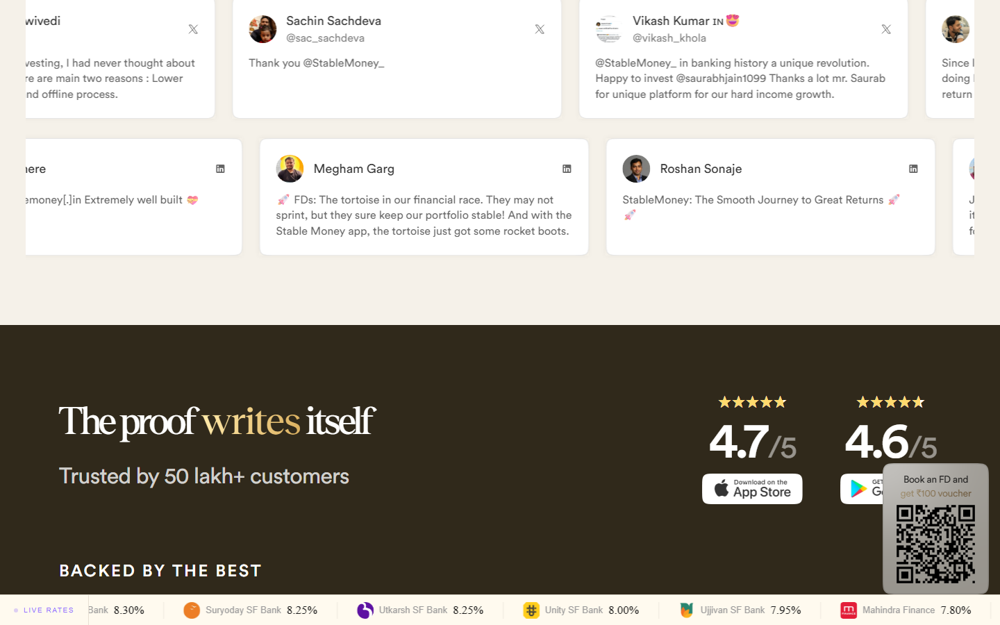

# Animation Reference

> Cinematic motion design extracted from live DOM. Follow these specs exactly to recreate the experience.

## Motion Technology Stack

| Library | Type | Notes |
|---------|------|-------|
| **Web Animations API (12 active)** | animation |  |
| Canvas (1 elements) | WebGL/3D | WebGL context detected - likely Three.js or custom shader |

## Scroll Journey

The page is **7,212px** tall. Each frame below shows what the user sees at that scroll depth.

> **Use these screenshots to understand WHAT animates, WHEN it animates, and HOW it moves.**

### 0% - Top / Hero
Scroll position: 0px


### 17% - Opening Section
Scroll position: 1,073px


### 33% - First Feature Section
Scroll position: 2,083px


### 50% - Mid-Page
Scroll position: 3,156px


### 67% - Lower Content
Scroll position: 4,229px


### 83% - Near Footer
Scroll position: 5,239px



### 100% - Bottom / Footer
Scroll position: 6,312px


## CSS Keyframes (36 extracted)

### `@keyframes svelte-1s476lo-moveSlides`

Duration: `60s` · Easing: `linear` · Delay: `0s` · Iteration: `infinite` · Fill: `none`

Used by: `.bank-row-container-normal.svelte-1s476lo`, `.bank-row-container-reverse.svelte-1s476lo`

```css
@keyframes svelte-1s476lo-moveSlides {
  0% {
    transform: translate(0px);
  }
  100% {
    transform: translate(-50%);
  }
}
```

> Transform/motion animation

### `@keyframes swipe-out`

Duration: `0.2s` · Easing: `ease-out` · Delay: `0s` · Iteration: `1` · Fill: `forwards`

Used by: `[data-sonner-toast][data-swipe-out="true"][data-y-position="bottom"], [data-sonn`

```css
@keyframes swipe-out {
  0% {
    transform: translateY(calc(var(--lift) * var(--offset) + var(--swipe-amount)));
    opacity: 1;
  }
  100% {
    transform: translateY(calc(var(--lift) * var(--offset) + var(--swipe-amount) + var(--lift) * -100%));
    opacity: 0;
  }
}
```

> Fade + motion enter animation

### `@keyframes sonner-fade-in`

Duration: `0.3s` · Easing: `ease` · Delay: `0s` · Iteration: `1` · Fill: `forwards`

Used by: `:where([data-sonner-toast][data-promise="true"]) :where([data-icon]) > svg`

```css
@keyframes sonner-fade-in {
  0% {
    opacity: 0;
    transform: scale(0.8);
  }
  100% {
    opacity: 1;
    transform: scale(1);
  }
}
```

> Fade + motion enter animation

### `@keyframes sonner-fade-out`

Duration: `0.2s` · Easing: `ease` · Delay: `0s` · Iteration: `1` · Fill: `forwards`

Used by: `.sonner-loading-wrapper[data-visible="false"]`

```css
@keyframes sonner-fade-out {
  0% {
    opacity: 1;
    transform: scale(1);
  }
  100% {
    opacity: 0;
    transform: scale(0.8);
  }
}
```

> Fade + motion enter animation

### `@keyframes sonner-spin`

Duration: `1.2s` · Easing: `linear` · Delay: `0s` · Iteration: `infinite` · Fill: `none`

Used by: `.sonner-loading-bar`

```css
@keyframes sonner-spin {
  0% {
    opacity: 1;
  }
  100% {
    opacity: 0.15;
  }
}
```

> Opacity fade

### `@keyframes svelte-13p1stj-pulse`

Duration: `1.8s` · Easing: `ease-in-out` · Delay: `0s` · Iteration: `infinite` · Fill: `none`

Used by: `.pulse-dot.svelte-13p1stj`

```css
@keyframes svelte-13p1stj-pulse {
  0%, 100% {
    opacity: 1;
  }
  50% {
    opacity: 0.3;
  }
}
```

> Opacity fade

### `@keyframes nprogress-spinner`

Duration: `0.4s` · Easing: `linear` · Delay: `0s` · Iteration: `infinite` · Fill: `none`

Used by: `#nprogress .spinner-icon`

```css
@keyframes nprogress-spinner {
  0% {
    transform: rotate(0deg);
  }
  100% {
    transform: rotate(360deg);
  }
}
```

> Transform/motion animation

### `@keyframes nprogress-spinner`

Duration: `0.4s` · Easing: `linear` · Delay: `0s` · Iteration: `infinite` · Fill: `none`

Used by: `#nprogress .spinner-icon`

```css
@keyframes nprogress-spinner {
  0% {
    transform: rotate(0deg);
  }
  100% {
    transform: rotate(360deg);
  }
}
```

> Transform/motion animation

### `@keyframes svelte-ydjd51-fade-in`

Duration: `0.21s, 0.3s` · Easing: `cubic-bezier(0, 0, 0.2, 1), cubic-bezier(0.4, 0, 0.2, 1)` · Delay: `90ms, 0s` · Iteration: `1, 1` · Fill: `both, both`

Used by: `:root::view-transition-new(root)`

```css
@keyframes svelte-ydjd51-fade-in {
  0% {
    opacity: 0;
  }
}
```

> Opacity fade

### `@keyframes svelte-ydjd51-fade-out`

Duration: `90ms, 0.3s` · Easing: `cubic-bezier(0.4, 0, 1, 1), cubic-bezier(0.4, 0, 0.2, 1)` · Delay: `0s, 0s` · Iteration: `1, 1` · Fill: `both, both`

Used by: `:root::view-transition-old(root)`

```css
@keyframes svelte-ydjd51-fade-out {
  100% {
    opacity: 0;
  }
}
```

> Opacity fade

### `@keyframes svelte-ydjd51-slide-from-right`

Duration: `0.21s, 0.3s` · Easing: `cubic-bezier(0, 0, 0.2, 1), cubic-bezier(0.4, 0, 0.2, 1)` · Delay: `90ms, 0s` · Iteration: `1, 1` · Fill: `both, both`

Used by: `:root::view-transition-new(root)`

```css
@keyframes svelte-ydjd51-slide-from-right {
  0% {
    transform: translate(30px);
  }
}
```

> Transform/motion animation

### `@keyframes svelte-ydjd51-slide-to-left`

Duration: `90ms, 0.3s` · Easing: `cubic-bezier(0.4, 0, 1, 1), cubic-bezier(0.4, 0, 0.2, 1)` · Delay: `0s, 0s` · Iteration: `1, 1` · Fill: `both, both`

Used by: `:root::view-transition-old(root)`

```css
@keyframes svelte-ydjd51-slide-to-left {
  100% {
    transform: translate(-30px);
  }
}
```

> Transform/motion animation

### `@keyframes svelte-1orvz8a-spin`

Duration: `1s` · Easing: `linear` · Delay: `0s` · Iteration: `infinite` · Fill: `none`

Used by: `.spinner.svelte-1orvz8a`

```css
@keyframes svelte-1orvz8a-spin {
  0% {
    transform: rotate(0deg);
  }
  100% {
    transform: rotate(360deg);
  }
}
```

> Transform/motion animation

### `@keyframes svelte-1orvz8a-run`

Duration: `2.5s` · Easing: `ease` · Delay: `0s` · Iteration: `infinite` · Fill: `none`

Used by: `.shimmer.svelte-1orvz8a`

```css
@keyframes svelte-1orvz8a-run {
  0% {
    transform: translate(0px);
  }
  100% {
    transform: translate(var(--translate-width));
  }
}
```

> Transform/motion animation

### `@keyframes svelte-1sn02pw-slide-in-right`

Duration: `0.5s` · Easing: `ease` · Delay: `0s` · Iteration: `1` · Fill: `none`

Used by: `.mobile-content.svelte-1sn02pw`

```css
@keyframes svelte-1sn02pw-slide-in-right {
  0% {
    transform: translate(100%);
    opacity: 0;
  }
  100% {
    transform: translate(0px);
    opacity: 1;
  }
}
```

> Fade + motion enter animation

### `@keyframes fadeIn`

Used by: `[data-vaul-overlay][data-vaul-snap-points="false"][data-state="open"]`

```css
@keyframes fadeIn {
  0% {
    opacity: 0;
  }
  100% {
    opacity: 1;
  }
}
```

> Opacity fade

### `@keyframes fadeOut`

Used by: `[data-vaul-overlay][data-state="closed"]`

```css
@keyframes fadeOut {
  100% {
    opacity: 0;
  }
}
```

> Opacity fade

### `@keyframes slideFromBottom`

Used by: `[data-vaul-drawer][data-vaul-snap-points="false"][data-vaul-drawer-direction="bo`

```css
@keyframes slideFromBottom {
  0% {
    transform: translate3d(0,var(--initial-transform, 100%),0);
  }
  100% {
    transform: translateZ(0px);
  }
}
```

> Transform/motion animation

### `@keyframes slideToBottom`

Used by: `[data-vaul-drawer][data-vaul-snap-points="false"][data-vaul-drawer-direction="bo`

```css
@keyframes slideToBottom {
  100% {
    transform: translate3d(0,var(--initial-transform, 100%),0);
  }
}
```

> Transform/motion animation

### `@keyframes slideFromTop`

Used by: `[data-vaul-drawer][data-vaul-snap-points="false"][data-vaul-drawer-direction="to`

```css
@keyframes slideFromTop {
  0% {
    transform: translate3d(0,calc(var(--initial-transform, 100%) * -1),0);
  }
  100% {
    transform: translateZ(0px);
  }
}
```

> Transform/motion animation

### `@keyframes slideToTop`

Used by: `[data-vaul-drawer][data-vaul-snap-points="false"][data-vaul-drawer-direction="to`

```css
@keyframes slideToTop {
  100% {
    transform: translate3d(0,calc(var(--initial-transform, 100%) * -1),0);
  }
}
```

> Transform/motion animation

### `@keyframes slideFromLeft`

Used by: `[data-vaul-drawer][data-vaul-snap-points="false"][data-vaul-drawer-direction="le`

```css
@keyframes slideFromLeft {
  0% {
    transform: translate3d(calc(var(--initial-transform, 100%) * -1),0,0);
  }
  100% {
    transform: translateZ(0px);
  }
}
```

> Transform/motion animation

### `@keyframes slideToLeft`

Used by: `[data-vaul-drawer][data-vaul-snap-points="false"][data-vaul-drawer-direction="le`

```css
@keyframes slideToLeft {
  100% {
    transform: translate3d(calc(var(--initial-transform, 100%) * -1),0,0);
  }
}
```

> Transform/motion animation

### `@keyframes slideFromRight`

Used by: `[data-vaul-drawer][data-vaul-snap-points="false"][data-vaul-drawer-direction="ri`

```css
@keyframes slideFromRight {
  0% {
    transform: translate3d(var(--initial-transform, 100%),0,0);
  }
  100% {
    transform: translateZ(0px);
  }
}
```

> Transform/motion animation

### `@keyframes slideToRight`

Used by: `[data-vaul-drawer][data-vaul-snap-points="false"][data-vaul-drawer-direction="ri`

```css
@keyframes slideToRight {
  100% {
    transform: translate3d(var(--initial-transform, 100%),0,0);
  }
}
```

> Transform/motion animation

### `@keyframes svelte-lisx3c-gradientRotate`

Duration: `10s` · Easing: `linear` · Delay: `0s` · Iteration: `infinite` · Fill: `none`

Used by: `.slantedDiv.svelte-lisx3c`

```css
@keyframes svelte-lisx3c-gradientRotate {
  0% {
    background-position-x: 0%;
    background-position-y: 50%;
  }
  50% {
    background-position-x: 100%;
    background-position-y: 50%;
  }
  100% {
    background-position-x: 0%;
    background-position-y: 50%;
  }
}
```

> Background color/gradient shift · Background position (shimmer/scroll)

### `@keyframes svelte-sot3qq-shine`

Duration: `2s` · Easing: `ease` · Delay: `0s` · Iteration: `infinite` · Fill: `none`

Used by: `.new-tag.svelte-sot3qq .shine:where(.svelte-sot3qq)`

```css
@keyframes svelte-sot3qq-shine {
  0% {
    left: -10px;
  }
  100% {
    left: 28px;
  }
}
```

### `@keyframes svelte-kbtnuy-shine`

Duration: `2s` · Easing: `ease` · Delay: `0s` · Iteration: `infinite` · Fill: `none`

Used by: `.new-tag.svelte-kbtnuy .shine:where(.svelte-kbtnuy)`

```css
@keyframes svelte-kbtnuy-shine {
  0% {
    left: -10px;
  }
  100% {
    left: 28px;
  }
}
```

### `@keyframes svelte-75itld-stat-pulse`

Duration: `1.6s` · Easing: `ease-in-out` · Delay: `0s` · Iteration: `infinite` · Fill: `none`

Used by: `.live-dot.svelte-75itld`

```css
@keyframes svelte-75itld-stat-pulse {
  0%, 100% {
    opacity: 0.45;
    transform: scale(0.85);
  }
  50% {
    opacity: 1;
    transform: scale(1.1);
  }
}
```

> Fade + motion enter animation

### `@keyframes svelte-cy0ia1-gradientRotate`

Duration: `10s` · Easing: `linear` · Delay: `0s` · Iteration: `infinite` · Fill: `none`

Used by: `.slanted-div.svelte-cy0ia1`

```css
@keyframes svelte-cy0ia1-gradientRotate {
  0% {
    background-position-x: 0%;
    background-position-y: 50%;
  }
  50% {
    background-position-x: 100%;
    background-position-y: 50%;
  }
  100% {
    background-position-x: 0%;
    background-position-y: 50%;
  }
}
```

> Background color/gradient shift · Background position (shimmer/scroll)

### `@keyframes svelte-131oa78-moveSlidesLeft`

Duration: `80s` · Easing: `linear` · Delay: `0s` · Iteration: `infinite` · Fill: `none`

Used by: `.TestimonialRowContainer.svelte-131oa78`

```css
@keyframes svelte-131oa78-moveSlidesLeft {
  0% {
    transform: translate(0px);
  }
  100% {
    transform: translate(-50%);
  }
}
```

> Transform/motion animation

### `@keyframes svelte-efa5u5-shimmer`

Duration: `1.5s` · Easing: `ease` · Delay: `0s` · Iteration: `infinite` · Fill: `none`

Used by: `.shimmer-bg.svelte-efa5u5`

```css
@keyframes svelte-efa5u5-shimmer {
  0% {
    background-position-x: -200px;
    background-position-y: 0px;
  }
  100% {
    background-position-x: calc(100% + 200px);
    background-position-y: 0px;
  }
}
```

> Background color/gradient shift · Background position (shimmer/scroll)

### `@keyframes spin`

```css
@keyframes spin {
  100% {
    transform: rotate(360deg);
  }
}
```

> Transform/motion animation

### `@keyframes pulse`

```css
@keyframes pulse {
  50% {
    opacity: 0.5;
  }
}
```

> Opacity fade

### `@keyframes fake-animation`

```css
@keyframes fake-animation {
}
```

### `@keyframes svelte-qtyrkc-fadeSlideIn`

```css
@keyframes svelte-qtyrkc-fadeSlideIn {
  0% {
    opacity: 0;
    transform: translateY(20px);
  }
  100% {
    opacity: 1;
    transform: translateY(0px);
  }
}
```

> Fade + motion enter animation

## Motion Tokens (CSS Variables)

### Duration Tokens

```css
--default-transition-duration: .15s;
```

### Easing Tokens

```css
--default-transition-timing-function: cubic-bezier(.4,0,.2,1);
--ease-in: cubic-bezier(.4,0,1,1);
--ease-out: cubic-bezier(0,0,.2,1);
--ease-in-out: cubic-bezier(.4,0,.2,1);
```

## Global Transition Declarations

These `transition` values were extracted from CSS rules across the site:

```css
transition: transform 0.4s, opacity 0.4s, height 0.4s, box-shadow 0.2s;
transition: opacity 0.4s, box-shadow 0.2s;
transition: opacity 0.1s, background 0.2s, border-color 0.2s;
transition: opacity 0.4s;
transition: transform 0.5s, opacity 0.2s;
transition: opacity 0.2s, transform 0.2s;
transition: transform 0.5s cubic-bezier(0.32, 0.72, 0, 1);
transition: opacity 0.5s cubic-bezier(0.32, 0.72, 0, 1);
transition: background 0.2s;
transition: transform 0.32s cubic-bezier(0.22, 1, 0.36, 1);
transition: scale 0.32s cubic-bezier(0.22, 1, 0.36, 1);
```

## How to Recreate This Motion Design

### Step 1 - Install Dependencies

```bash
```

### Step 2 - Scroll-Reveal Pattern

Elements that animate into view follow this pattern:

```css
/* Initial hidden state */
.reveal {
  opacity: 0;
  transform: translateY(40px);
  transition: opacity .15s cubic-bezier(.4,0,.2,1),
              transform .15s cubic-bezier(.4,0,.2,1);
}
.reveal.visible {
  opacity: 1;
  transform: translateY(0);
}
```

### Step 3 - Key Motion Principles

- **WebGL/3D layer detected** - product visualizations use Three.js or custom WebGL. Use `<canvas>` with Three.js for 3D product renders
- **Canvas elements (1)** - animated via requestAnimationFrame loop. Use canvas for particle effects, gradient animations, and WebGL scenes
- **Duration scale:** `.15s` · `0.4s` · `0.2s` - use these values, never invent new durations
- **Always add** `@media (prefers-reduced-motion: reduce) { * { animation-duration: 0.01ms !important; transition-duration: 0.01ms !important; } }`

### Step 4 - Scroll Journey Reference

Match what happens at each scroll position:

- **0%** (`0px`) → `screens/scroll/scroll-000.png`
- **17%** (`1073px`) → `screens/scroll/scroll-017.png`
- **33%** (`2083px`) → `screens/scroll/scroll-033.png`
- **50%** (`3156px`) → `screens/scroll/scroll-050.png`
- **67%** (`4229px`) → `screens/scroll/scroll-067.png`
- **83%** (`5239px`) → `screens/scroll/scroll-083.png`
- **100%** (`6312px`) → `screens/scroll/scroll-100.png`

