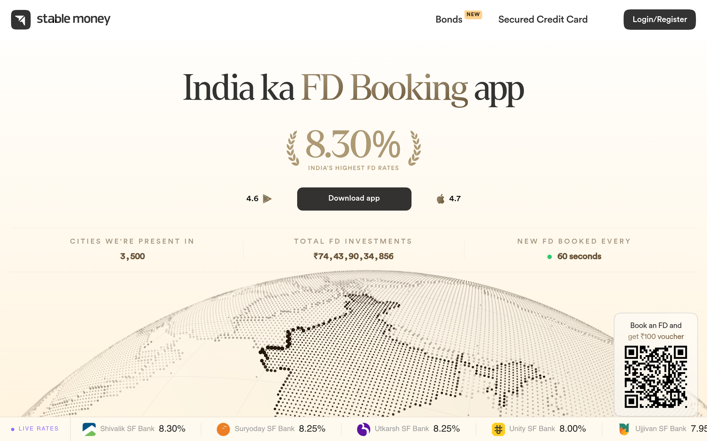

# stablemoney DESIGN.md

> Auto-generated design system — reverse-engineered via static analysis by skillui.
> Frameworks: None detected
> Colors: 20 · Fonts: 3 · Components: 8
> Icon library: not detected · State: not detected
> Primary theme: dark · Dark mode toggle: yes · Motion: expressive

## Visual Reference

**Match this design exactly** — study colors, fonts, spacing, and component shapes before writing any UI code.



---

## 1. Visual Theme & Atmosphere

This is a **dark-themed** interface with a cool tone. Depth is expressed through layered shadows and subtle surface color variation. Typography pairs **Roboto** for display/headings with **Circular Std** for body text, creating clear visual hierarchy through type contrast. Spacing follows a **4px base grid** (compact density), with scale: 2, 4, 6, 8, 10, 12, 14, 16px. The accent color **#a66cff** anchors interactive elements (buttons, links, focus rings). Motion is expressive — spring physics, layout animations, and staggered reveals are part of the visual language.

---

## 2. Color Palette & Roles

| Token | Hex | Role | Use |
|---|---|---|---|
| tile-color | `#000000` | background | Page background, darkest surface |
| card | `#1a1a1a` | surface | Card and panel backgrounds |
| theme-color | `#ffffff` | text-primary | Headings and body text |
| text-muted | `#685337` | text-muted | Captions, placeholders, secondary info |
| normal-border | `#333333` | border | Dividers, card borders, outlines |
| accent | `#a66cff` | accent | CTAs, links, focus rings, active states |
| success-bg | `#ecfdf3` | success | Success states, positive indicators |
| warning | `#ffd96d` | warning | Warning states, caution indicators |
| info | `#916cff` | info | Informational highlights |
| warning-bg | `#fffcf0` | unknown | Palette color |
| success | `#12bf57` | unknown | Palette color |
| unknown | `#30291b` | unknown | Palette color |
| unknown | `#e4eaef` | unknown | Palette color |
| unknown | `#000042` | unknown | Palette color |
| warning-border | `#fdf5d3` | unknown | Palette color |
| background | `#09080c` | unknown | Palette color |
| info-text | `#0973dc` | unknown | Palette color |
| info-bg | `#000d1f` | unknown | Palette color |
| unknown | `#7c7d25` | unknown | Palette color |
| unknown | `#f4f0ff` | unknown | Palette color |

### Dark Mode Token Mapping

| Variable | Light | Dark |
|---|---|---|
| `--background` | `0 0% 100%` | `255 20% 4%` |
| `--foreground` | `0 0% 0%` | `0 0% 100%` |
| `--card` | `0 0% 100%` | `0 0% 10%` |
| `--card-foreground` | `0 0% 0%` | `0 0% 100%` |
| `--primary` | `0 0% 0%` | `0 0% 100%` |
| `--primary-foreground` | `0 0% 100%` | `0 0% 0%` |
| `--destructive` | `0 72.2% 50.6%` | `0 100% 67%` |
| `--destructive-foreground` | `210 40% 98%` | `var(--foreground)` |
| `--ring` | `222.2 84% 4.9%` | `hsl(212.7,26.8%,83.9)` |

### CSS Variable Tokens

```css
--border-radius: 8px;
--normal-border: var(--gray4);
--success-border: hsl(145,92%,91%);
--info-border: hsl(221,91%,91%);
--warning-border: hsl(49,91%,91%);
--error-border: hsl(359,100%,94%);
--normal-border: hsl(0,0%,20%);
--normal-border: var(--gray3);
--normal-border: hsl(0,0%,20%);
--success-border: hsl(147,100%,12%);
--info-border: hsl(223,100%,12%);
--warning-border: hsl(60,100%,12%);
--error-border: hsl(357,89%,16%);
--tw-border-style: solid;
--sd-border-w-xs: calc(.3px*var(--sd-scale-factor,1));
--sd-border-w-sm: calc(.5px*var(--sd-scale-factor,1));
--sd-border-w-md: calc(1px*var(--sd-scale-factor,1));
--sd-border-color: var(--sd-black-10);
--sd-border-w-xs: calc(.3px*var(--sd-scale-factor,1));
--sd-border-w-sm: calc(.5px*var(--sd-scale-factor,1));
```


---

## 3. Typography Rules

**Font Stack:**
- **Circular Std** — Heading 1, Heading 2, Heading 3
- **Roboto** — Body, Caption
- **SFMono-Regular** — Code

**Font Sources:**

```css
@font-face {
  font-family: "CircularStd";
  src: url("fonts/CircularStd-Regular.woff") format("woff");
  font-weight: 400;
}
@font-face {
  font-family: "RecklessNeue";
  src: url("fonts/RecklessNeue-Regular.woff2") format("woff2");
  font-weight: 400;
}
@font-face {
  font-family: "DentonTest";
  src: url("fonts/DentonTest-Regular.otf") format("truetype");
  font-weight: 400;
}
@font-face {
  font-family: "Denton";
  src: url("fonts/Denton-700.otf") format("truetype");
  font-weight: 700;
}
@font-face {
  font-family: "Copperplate";
  src: url("fonts/Copperplate-Regular.woff") format("woff");
  font-weight: 400;
}
@font-face {
  font-family: "Roboto";
  src: url("fonts/Roboto-Bold.ttf") format("truetype");
  font-weight: 700;
}
@font-face {
  font-family: "Roboto";
  src: url("fonts/Roboto-Regular.ttf") format("truetype");
  font-weight: 400;
}
```

| Role | Font | Size | Weight |
|---|---|---|---|
| Heading 1 | Circular Std | 253px | 700 |
| Heading 2 | Circular Std | 180px | 700 |
| Heading 3 | Circular Std | 140px | 700 |
| Body | Roboto | 13px | 400 |
| Caption | Roboto | 16px | 400 |
| Code | SFMono-Regular | 14px | 400 |

**Typographic Rules:**
- Limit to 3 font families max per screen
- Use **Circular Std** for body/UI text, **Roboto** for display/headings
- Maintain consistent hierarchy: no more than 3-4 font sizes per screen
- Headings use bold (600-700), body uses regular (400)
- Line height: 1.5 for body text, 1.2 for headings
- Use color and opacity for secondary hierarchy, not additional font sizes


---

## 4. Component Stylings

### Layout (1)

**Footer** — `html`

### Navigation (1)

**Navigation** — `html`

### Data Display (2)

**Card** — `html`
- Variants: `cell`, `shimmer`

**Badge** — `html`

### Data Input (1)

**Button** — `html`
- Variants: `uy`
- Animation: 

### Media (3)

**Image** — `html`

**Icon** — `html`

**Map/Canvas** — `html`


---

## 5. Layout Principles

- **Base spacing unit:** 4px
- **Spacing scale:** 2, 4, 6, 8, 10, 12, 14, 16, 18, 20, 22, 24
- **Border radius:** .25rem, .3125rem, .375rem, 1rem, 2px, 4px, 6px, 8px, 8.265px, 10px, 11px, 12px, 13px, 14px, 16px, 20px, 24px, 47px, 55px, 999px
- **Max content width:** 1000px

**Spacing as Meaning:**
| Spacing | Use |
|---|---|
| 4-8px | Tight: related items within a group |
| 12-16px | Medium: between groups |
| 24-32px | Wide: between sections |
| 48px+ | Vast: major section breaks |


---

## 6. Depth & Elevation

### Flat — subtle depth hints

- `0 0 0 2px #0006`

### Raised — cards, buttons, interactive elements

- `0 0 0 1px rgb(var(--tw-prose-kbd-shadows)/10%),0 3px rgb(var(--tw-prose-kbd-shadows)/10%)`
- `2px 0 5px #0000001a`

### Floating — dropdowns, popovers, modals

- `0 4px 12px #0000001a`
- `0 4px 12px #0000001a,0 0 0 2px #0003`
- `0 0 10px #29d,0 0 5px #29d`

### Overlay — full-screen overlays, top-level dialogs

- `inset 0 0 0 1000px #fff`
- `0 24px 48px -12px #68533738,0 8px 16px -4px #68533724`
- `0 24px 48px -12px #00000040`

### Z-Index Scale

`0, 1, 2, 5, 10, 20, 30, 50, 51, 98, 99, 100, 200, 1000, 1031, 9996, 9998, 9999, 10001, 10002, 999999999`


---

## 7. Animation & Motion

This project uses **expressive motion**. Animations are an integral part of the experience.

### CSS Animations

- `@keyframes swipe-out`
- `@keyframes sonner-fade-in`
- `@keyframes sonner-fade-out`
- `@keyframes sonner-spin`
- `@keyframes svelte-13p1stj-pulse`
- `@keyframes shine`
- `@keyframes caret-blink`
- `@keyframes spin`

### Animated Components

- **Button**: 

### Motion Guidelines

- Duration: 150-300ms for micro-interactions, 300-500ms for page transitions
- Easing: `ease-out` for enters, `ease-in` for exits
- Always respect `prefers-reduced-motion`


---

## 8. Do's and Don'ts

### Do's

- Use `#a66cff` for interactive elements (buttons, links, focus rings)
- Use `#000000` as the primary page background
- Pair **Circular Std** (body) with **Roboto** (display) — these are the only allowed fonts
- Follow the **4px** spacing grid for all margins, padding, and gaps
- Use the defined shadow tokens for elevation — see Section 6
- Use border-radius from the scale: .25rem, .3125rem, .375rem, 1rem, 2px
- Reuse existing components from Section 4 before creating new ones
- Always use CSS variables for colors — never hardcode hex
- Test both light and dark modes for contrast

### Don'ts

- Don't introduce colors outside this palette — extend the design tokens first
- Don't introduce additional font families beyond Circular Std and Roboto and SFMono-Regular
- Don't use arbitrary spacing values — stick to multiples of 4px
- Don't create custom box-shadow values outside the system tokens
- Don't use arbitrary border-radius values — pick from the defined scale
- Don't duplicate component patterns — check Section 4 first
- Don't use backdrop-blur or blur effects

### Anti-Patterns (detected from codebase)

- No blur or backdrop-blur effects
- No zebra striping on tables/lists


---

## 9. Responsive Behavior

| Name | Value | Source |
|---|---|---|
| sm | 40rem | css |
| md | 48rem | css |
| lg | 64rem | css |
| xl | 80rem | css |
| 2xl | 96rem | css |
| xs | 471px | css |
| xs | 472px | css |
| sm | 500px | css |
| sm | 550px | css |
| sm | 600px | css |
| sm | 639px | css |
| sm | 640px | css |
| md | 699px | css |
| md | 700px | css |
| md | 750px | css |
| md | 757px | css |
| md | 768px | css |
| lg | 799px | css |
| lg | 800px | css |
| lg | 850px | css |
| lg | 851px | css |
| lg | 900px | css |
| lg | 961px | css |
| lg | 1000px | css |
| xl | 1074px | css |
| xl | 1279px | css |
| 2xl | 1430px | css |

**Approach:** Use `@media (min-width: ...)` queries matching the breakpoints above.


---

## 10. Agent Prompt Guide

Use these as starting points when building new UI:

### Build a Card

```
Background: #1a1a1a
Border: 1px solid #333333
Radius: 11px
Padding: 16px
Font: Circular Std
Use shadow tokens from Section 6.
```

### Build a Button

```
Primary: bg #a66cff, text white
Ghost: bg transparent, border #333333
Padding: 8px 16px
Radius: 11px
Hover: opacity 0.9 or lighter shade
Focus: ring with #a66cff
```

### Build a Page Layout

```
Background: #000000
Max-width: 1000px, centered
Grid: 4px base
Responsive: mobile-first, breakpoints from Section 9
```

### Build a Stats Card

```
Surface: #1a1a1a
Label: #685337 (muted, 12px, uppercase)
Value: #ffffff (primary, 24-32px, bold)
Status: use success/warning/danger from Section 2
```

### Build a Form

```
Input bg: #000000
Input border: 1px solid #333333
Focus: border-color #a66cff
Label: #685337 12px
Spacing: 16px between fields
Radius: 11px
```

### General Component

```
1. Read DESIGN.md Sections 2-6 for tokens
2. Colors: only from palette
3. Font: Circular Std, type scale from Section 3
4. Spacing: 4px grid
5. Components: match patterns from Section 4
6. Elevation: shadow tokens
```
